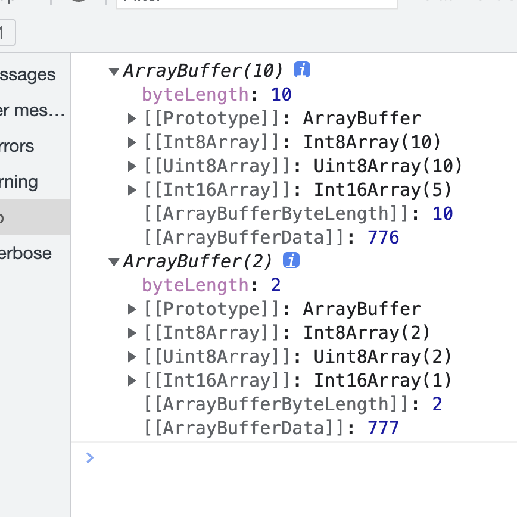
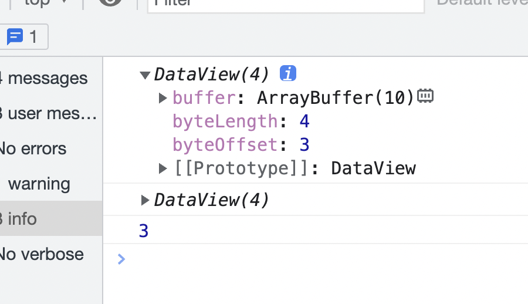
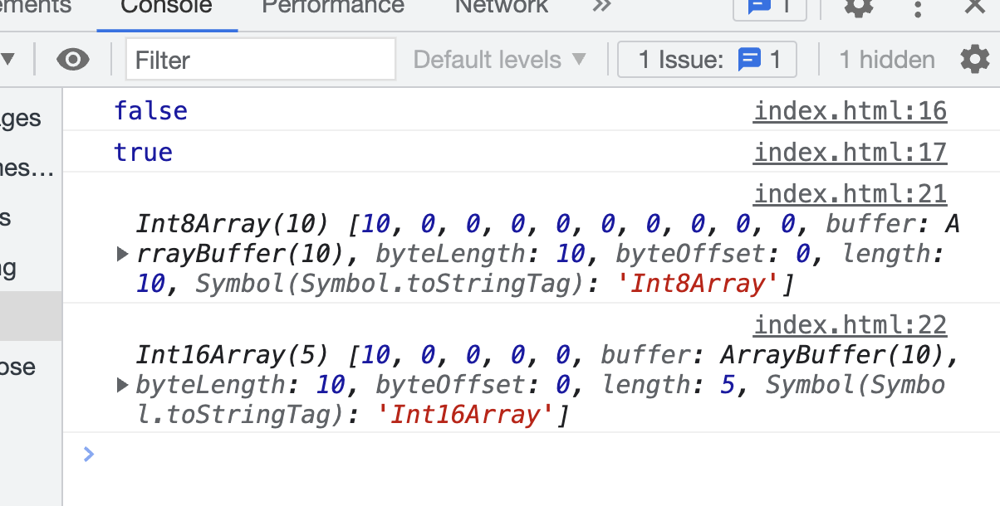

## 小知识点

```js
Boolean(['sub1'] == 'sub1') // ture
```

判断是不是数组

```js
var isArray = function(obj){
    return Object.prototype.toString.call(obj) === '[object Array]'
}

instanceof Array

```

```js
var isType = function(type) {
    return function(obj) {
        return Object.prototype.toString.call(obj) === '[object' + type + ']'
    }
}
var isStirng = isType('String');
var isArray = isType('Array');
var isNumber = isType('Number');
```


## 数组的空位

注意，空位不是`undefined`，一个位置的值等于`undefined`，依然是有值的。空位是没有任何值，`in`运算符可以说明这一点。

```javascript
0 in [undefined, undefined, undefined] // true
0 in [, , ,] // false
```

上面代码说明，第一个数组的 0 号位置是有值的，第二个数组的 0 号位置没有值。

> ES5 对空位的处理，已经很不一致了，大多数情况下会忽略空位。

- `forEach()`, `filter()`, `reduce()`, `every()` 和`some()`都会跳过空位。
- `map()`会跳过空位，但会保留这个值
- `join()`和`toString()`会将空位视为`undefined`，而`undefined`和`null`会被处理成空字符串。

>  ES6 则是明确将空位转为`undefined`。

`Array.from`方法会将数组的空位，转为`undefined`，也就是说，这个方法不会忽略空位。


## 不改变原数组

|                         方法名                          |       参数aaaaaaaaaaaaaaaaaaaaaaaaaa       |                                                 返回值                                                 | 描述                                                                                                                                                                                                                                                                                                                                                                                                       |
| :-----------------------------------------------------: | :----------------------------------------: | :----------------------------------------------------------------------------------------------------: | ---------------------------------------------------------------------------------------------------------------------------------------------------------------------------------------------------------------------------------------------------------------------------------------------------------------------------------------------------------------------------------------------------------- |
|                    concat（浅拷贝）                     | 数组和/或值（可省略）（可以有0个或无数个） |                                                  数组                                                  |                                                                                                                                                                                                                                                                                                                                                                                                            |
|                        entries()                        |       没有参数，数组实例或直接量调用       |                                        一个新的Array迭代器对象                                         | 一个新的 [`Array`](https://developer.mozilla.org/zh-CN/docs/Web/JavaScript/Reference/Array) 迭代器对象。[Array Iterator](http://www.ecma-international.org/ecma-262/6.0/#sec-createarrayiterator) [ɪtə'retɚ]是对象，它的原型（__proto__:Array Iterator）上有一个[next](http://www.ecma-international.org/ecma-262/6.0/#sec-%arrayiteratorprototype%.next)方法，可用用于遍历迭代器取得原数组的[key,value]。 |
|                         every()                         |                    2个                     |                                                 布尔值                                                 | 测试一个数组内的所有元素是否都能通过某个指定函数的测试。它返回一个布尔值。                                                                                                                                                                                                                                                                                                                                 |
|                        filter()                         |                    2个                     |                                                 新数组                                                 |                                                                                                                                                                                                                                                                                                                                                                                                            |
|                         find()                          |                    2个                     |                                  满足测试的第一个值（或`undefined`）                                   |                                                                                                                                                                                                                                                                                                                                                                                                            |
|                       findIndex()                       |                    2个                     |                                   满足测试的第一个元素的索引（或-1）                                   |                                                                                                                                                                                                                                                                                                                                                                                                            |
|                         flat()                          |                1个（可选）                 |                                                  数组                                                  | 按照一个可指定的深度递归遍历数组，并将所有元素与遍历到的子数组中的元素合并为一个新数组返回。                                                                                                                                                                                                                                                                                                               |
|                        flatMap()                        |                    2个                     |                                                 新数组                                                 | 使用映射函数映射每个元素，然后将结果压缩成一个新数组。它与 [map](https://developer.mozilla.org/en-US/docs/Web/JavaScript/Reference/Global_Objects/Array/map) 连着深度值为1的 [flat](https://developer.mozilla.org/en-US/docs/Web/JavaScript/Reference/Global_Objects/Array/flat) 几乎相同，但 `flatMap` 通常在合并成一种方法的效率稍微高一些。                                                             |
|                        forEach()                        |                    2个                     |                                               undefined                                                |                                                                                                                                                                                                                                                                                                                                                                                                            |
|                       includes()                        |                    2个                     |                                                 布尔值                                                 | 该方法的第二个参数表示搜索的起始位置，默认为`0`。如果第二个参数为负数，则表示倒数的位置，如果这时它大于数组长度（比如第二个参数为`-4`，但数组长度为`3`），则会重置为从`0`开始。可识别NaN。如果数组里面有NaN也能被找出来。indexOf() 不行                                                                                                                                                                    |
|                        indexOf()                        |                    2个                     |                                             数字类型的下标                                             | 会返回下标，下标的数据类型是number                                                                                                                                                                                                                                                                                                                                                                         |
|                         join()                          |                1个（可选）                 |                                                 字符串                                                 |                                                                                                                                                                                                                                                                                                                                                                                                            |
|                         keys()                          |           没有参数，同entries()            |                                        一个新的Array迭代器对象                                         |                                                                                                                                                                                                                                                                                                                                                                                                            |
|        <a href="#lastIndexOf">lastIndexOf()</a>         |                    2个                     |                                             数字类型的下标                                             | 从第二个参数的位置开始逆向查找，第二个参数的默认值为arr.length - 1; 因为是从后往前查找，所以当第二个参数为负值，并且绝对值大于数组的长度，会返回-1，即数组不会被查找（开始查找的位置，比第零位还要远 ）                                                                                                                                                                                                    |
|                <a href="#map">map()</a>                 |                    2个                     |                                              修改后的数组                                              | `callback` 每次执行后的返回值（包括 [`undefined`](https://developer.mozilla.org/zh-CN/docs/Web/JavaScript/Reference/Global_Objects/undefined)）组合起来形成一个新数组。 `callback` 函数只会在有值的索引上被调用；那些从来没被赋过值或者使用 `delete` 删除的索引则不会被调用。                                                                                                                              |
|      <a href="#reduce">reduce()</a> （从左到右加）      |       2个（第一个回调函数有4个参数）       |                                           函数累计处理的结果                                           | 如果没有提供初始值，则将使用数组中的第一个元素。 在没有初始值的空数组上调用 reduce 将报错。如果不给初始值，要保证数组不为空。数组中被删除的索引或从未被赋值的索引会跳过。                                                                                                                                                                                                                                  |
| <a href="#reduceRight">reduceRight()</a> （从右到左加） |                    同上                    |                                                  同上                                                  | 如果没有提供初始值，则将使用数组中的最后一个元素。 在没有初始值的空数组上调用 reduce 将报错。如果不给初始值，要保证数组不为空。否则，在空数组上调用 `reduce` 或 `reduceRight` 且未提供初始值（例如 `[].reduce( (acc, cur, idx, arr) => {} )` ）的话，会导致类型错误 `TypeError: reduce of empty array with no initial value`。数组中被删除的索引或从未被赋值的索引会跳过。                                 |
|           <a href="#slice">slice()</a>[slaɪs]           |               2个，都是可选                |                                       一个含有被提取元素的新数组                                       |                                                                                                                                                                                                                                                                                                                                                                                                            |
|               <a href="#some">some()</a>                |          2个，回调函数 + thisArg           |                                                 布尔值                                                 | `callback` 只会在那些”有值“的索引上被调用，不会在那些被删除或从来未被赋值的索引上调用。                                                                                                                                                                                                                                                                                                                    |
|           <a href="#toString">toString()</a>            |                  没有参数                  |                                                 字符串                                                 | [`Array`](https://developer.mozilla.org/zh-CN/docs/Web/JavaScript/Reference/Array)对象覆盖了[`Object`](https://developer.mozilla.org/zh-CN/docs/Web/JavaScript/Reference/Global_Objects/Object)的 `toString` 方法。对于数组对象，`toString` 方法连接数组并返回一个字符串，其中包含用逗号分隔的每个数组元素。当一个数组被作为文本值或者进行字符串连接操作时，将会自动调用其 `toString` 方法。               |
|             <a href="#values">values()</a>              |                  没有参数                  | 一个新的 [`Array`](https://developer.mozilla.org/zh-CN/docs/Web/JavaScript/Reference/Array) 迭代对象。 | **`values()`** 方法返回一个新的 **`Array Iterator`** 对象，该对象包含数组每个索引的值                                                                                                                                                                                                                                                                                                                      |
|                                                         |                                            |                                                                                                        |                                                                                                                                                                                                                                                                                                                                                                                                            |
|                                                         |                                            |                                                                                                        |                                                                                                                                                                                                                                                                                                                                                                                                            |
|                                                         |                                            |                                                                                                        |                                                                                                                                                                                                                                                                                                                                                                                                            |

### concat

##### 将三个数组合并为一个新数组：

```js
var num1 = [1, 2, 3],
    num2 = [4, 5, 6],
    num3 = [7, 8, 9];

var nums = num1.concat(num2, num3);

console.log(nums);
// results in [1, 2, 3, 4, 5, 6, 7, 8, 9]
```

##### 合并嵌套数组

```js
var num1 = [[1]];
var num2 = [2, [3]];
var num3=[5,[6]];

var nums = num1.concat(num2);

console.log(nums);
// results is [[1], 2, [3]]
```

### entries()

```js
const array1 = ['a', 'b', 'c'];

const iterator1 = array1.entries();

console.log(iterator1.next())
// Object { value: Array [0, "a"], done: false }

console.log(iterator1.next().value);
// Array [1, "b"]

console.log(iterator1.next().value);
// Array [2, "c"]
```

### every

**如果收到一个空数组，在一切情况下都返回`true`**

只要有一个不符合条件就返回false

第一个参数是一个回调函数，回调函数有三个参数

+ element： 数组的每一项
+ index（可选）：下标/索引
+ array：调用every的当前数组

第二个参数

+ thisArg：执行`callback`时使用的this值

如果为 `every` 提供一个 `thisArg` 参数，则它会被作为 `callback` 被调用时的 `this` 值。否则，`callback` 的 `this` 值在非严格模式下将是全局对象，严格模式下为 `undefined`。`callback` 函数最终观察到的 `this` 值是根据[通常函数所看到的 "this"的规则](https://developer.mozilla.org/zh-CN/docs/Web/JavaScript/Reference/Operators/this)确定的。


### filter

参数类型同every，如果没有符合条件的，返回空数组

如果为 `filter 提供一个 `thisArg` 参数，则它会被作为 `callback` 被调用时的 `this` 值。否则，`callback` 的 `this` 值在非严格模式下将是全局对象，严格模式下为 `undefined`。`callback` 函数最终观察到的 `this` 值是根据[通常函数所看到的 "this"的规则](https://developer.mozilla.org/zh-CN/docs/Web/JavaScript/Reference/Operators/this)确定的。


### find

参数类型同every，如果没有符合条件的，返回undefined

如果提供了 `thisArg`参数，那么它将作为每次 `callback`函数执行时的`this` ，如果未提供，则使用 [`undefined`](https://developer.mozilla.org/zh-CN/docs/Web/JavaScript/Reference/Global_Objects/undefined)。


### findIndex

参数类型同every，如果没有符合条件的，返回-1

如果一个 `thisArg` 参数被提供给 `findIndex`, 它将会被当作`this`使用在每次回调函数被调用的时候。如果没有被提供，将会使用[`undefined`](https://developer.mozilla.org/zh-CN/docs/Web/JavaScript/Reference/Global_Objects/undefined)。


### flat

只有一个参数，可不填，不填的话用默认值，默认值为1

```js
[1, 2, [3, 4]].flat()
// [1, 2, 3, 4]

[1, 2, [3, [4, 5]]].flat()
// [1, 2, 3, [4, 5]]

[1, 2, [3, [4, 5]]].flat(2)
// [1, 2, 3, 4, 5]


// 如果不管有多少层嵌套，都要转成一维数组，可以用Infinity关键字作为参数。
[1, [2, [3]]].flat(Infinity)
// [1, 2, 3]


// 如果原数组有空位，flat()方法会跳过空位。
[1, 2, , 4, 5].flat()
// [1, 2, 4, 5]
```


### flatMap()

看不懂

```js
let arr1 = ["it's Sunny in", "", "California"];

arr1.map(x => x.split(" "));
// [["it's","Sunny","in"],[""],["California"]]

arr1.flatMap(x => x.split(" "));
// ["it's","Sunny","in", "", "California"]
```


### forEach()

`forEach()` 不会直接改变调用它的对象，但是那个对象可能会被 `callback` 函数改变


### includes()

返回一个布尔值
用 Object.is 比较
该方法的第二个参数表示搜索的起始位置，默认为`0`。如果第二个参数为负数，则表示倒数的位置，如果这时它大于数组长度（比如第二个参数为`-4`，但数组长度为`3`），则会重置为从`0`开始。

```js
[1, 2, 3].includes(4)     // false
[1, 2, NaN].includes(NaN) // true
[1, 2, 3].includes(3, 3);  // false
[1, 2, 3].includes(3, -1); // true
```


### indexOf()

两个参数，第一个参数是要查找的元素，第二个参数是开始查找的位置（包括该位）

+ 如果索引大于或等于数组的长度，意味着不会在数组里查找，返回-1
+ 如果索引值为负值，从最后一位开始查找。-1代表最后一位元素，-2代表倒数第二位
+ 当索引值是一个负值，索引的绝对值大于或等于数组的长度，相当于索引为0.整个数组都会被查询


### join()

指定一个字符串分割数组每个元素，

+ 不写参数的话，数组元素用逗号分割
+ 参数是一个空串，所有元素之间没有任何字符，数组被连接成一整个字符串
+ 如果一个元素是 `undefined` 或 `null` 他会被转换成空字符串

```js
var a = ['Wind', 'Rain', 'Fire'];
var myVar1 = a.join();      // 不写参数，myVar1的值变为"Wind,Rain,Fire"
var myVar2 = a.join(', ');  // myVar2的值变为"Wind, Rain, Fire"
var myVar3 = a.join(' + '); // myVar3的值变为"Wind + Rain + Fire"
var myVar4 = a.join('');    // 参数为空串，myVar4的值变为"WindRainFire"
let arr = ['a', 'b', undefined, 'c'].join('') // "abc"
```

+ 也可以连接类数组

```js
function f(a, b, c) {
  var s = Array.prototype.join.call(arguments);
  console.log(s); // '1,a,true'
}
f(1, 'a', true);
```


### keys()

索引迭代器会包含那些没有对应元素的索引

```js
var arr = ["a", , "c"];  // 如果arr里面有一位没有元素
let iterator = arr.keys();
console.log(itereator)  // Array Iterator  对象里面什么都没有，只有一个__proto__ 属性，__proto__ 里面有一个 next() 方法
var denseKeys = [...arr.keys()];
console.log(denseKeys);  // [0, 1, 2]

for (const key of iterator) {
  console.log(key);  // 会打印出来0，1，2
}

// 如果用对象的keys(),就会忽略中间缺少的那一位
var arr = ["a", , "c"];
var sparseKeys = Object.keys(arr);
console.log(sparseKeys); // ['0', '2']  会空过1，直接到2
```


### <a id="lastIndexOf">lastIndexOf()</a>

第一个参数是被查找的元素

```js
var array = [2, 5, 9, 2];
var index = array.lastIndexOf(2);
// index is 3
index = array.lastIndexOf(7);
// index is -1
index = array.lastIndexOf(2, 3);
// index is 3
index = array.lastIndexOf(2, 2);
// index is 0
index = array.lastIndexOf(2, -2);
// index is 0
index = array.lastIndexOf(2, -1);
// index is 3
index = array.lastIndexOf(2, -4);
// index is 0
index = array.lastIndexOf(2, -5);
// index is -1
```


### <a id="map">map()</a>

如果 `thisArg` 参数提供给`map`，则会被用作回调函数的`this`值。否则[`undefined`](https://developer.mozilla.org/zh-CN/docs/Web/JavaScript/Reference/Global_Objects/undefined)会被用作回调函数的`this`值。`this`的值最终相对于`callback`函数的可观察性是依据[the usual rules for determining the this seen by a function](https://developer.mozilla.org/en-US/docs/Web/JavaScript/Reference/Operators/this)决定的

`map `不修改调用它的原数组本身（当然可以在 `callback` 执行时改变原数组）

```js
const array1 = [1, 4, 9, 16];

// pass a function to map
const map1 = array1.map(x => x * 2);
console.log(array1)  // [1, 4, 9, 16]
console.log(map1);   // [2, 8, 18, 32]
```


VOP.png)


### <a id="reduce">reduce()</a>

执行数组中每个值 (如果没有提供 `initialValue则第一个值除外`) 的函数，包含两个参数：

上面的第一个值除外，是指，如果没有提供初始值的话，reduce会把数组的第一个值作为初始值，就不会被放进数组的循环遍历中，数组会从第二个值开始循环遍历

+ 回调函数

  + **`accumulator`** 累计器累计回调的返回值; 它是上一次调用回调时返回的累积值，或`initialValue`（见于下方）。

  + `currentValue` 数组中正在处理的元素。
  + `index` 可选 数组中正在处理的当前元素的索引。 如果提供了`initialValue`，则起始索引号为0，否则从索引1起始。
  + `array` 可选 调用`reduce()`的数组

+ `initialValue` 可选
  + 作为第一次调用 `callback`函数时的第一个参数的值。 如果没有提供初始值，则将使用数组中的第一个元素。 在没有初始值的空数组上调用 reduce 将报错。


### <a id="slice">slice()</a>

+ 没有参数，不截取，返回原先整个数组
+ 一个参数：从该位开始截取，一直到最后一位，
  + 如果为负数，最后一位是-1
  + 如果第一个参数超出原数组索引返回，返回空数组
+ 两个参数：不包括该位
  + 如果该参数为负数， 则它表示在原数组中的倒数第几个元素结束抽取。
  + 如果如果 `end` 大于数组的长度，`slice` 也会一直提取到原数组末尾。
  + 如果开始位和结束位是同一个位，返回空数组
  + 如果结束位在开始位的前方，返回空数组

```js
const animals = ['ant', 'bison', 'camel', 'duck', 'elephant'];

console.log(animals.slice(3, -1)); // ["duck"]

console.log(animals.slice(3, -2)); // []

console.log(animals.slice(3, -3)); // []
```


### <a id="some">some()</a>

如果一个`thisArg`参数提供给some()，它将被用作调用的 `callback`的 `this` 值。否则， 它的 `this` value将是 `undefined`。`this`的值最终通过callback来观察，根据 [the usual rules for determining the `this` seen by a function](https://developer.mozilla.org/en-US/docs/Web/JavaScript/Reference/Operators/this)的this判定规则来确定。


### <a id="toString">toString()</a>

```js
const array1 = [1, 2, 'a', '1a'];

console.log(array1.toString());
// expected output: "1,2,a,1a" 相当于join()不加参数
console.log(array1)
// [1, 2, "a", "1a"]
```


### <a id="values">values()</a>

```js
const array1 = ['a', 'b', 'c'];
const iterator = array1.values();

for (const value of iterator) {
  console.log(value);
}

// "a"
// "b"
// "c"
```


使用 .next() 迭代

```js
var arr = ['a', 'b', 'c', 'd', 'e'];
var iterator = arr.values();
iterator.next();               // Object { value: "a", done: false }
iterator.next().value;         // "b"
iterator.next()["value"];      // "c"
iterator.next();               // Object { value: "d", done: false }
iterator.next();               // Object { value: "e", done: false }
iterator.next();               // Object { value: undefined, done: true }
iteraroe.next().value;         // undefined
```


## 改变原数组

|              方法名              |         参数          |                                                                  返回值                                                                   |                                                                                         描述                                                                                          |
| :------------------------------: | :-------------------: | :---------------------------------------------------------------------------------------------------------------------------------------: | :-----------------------------------------------------------------------------------------------------------------------------------------------------------------------------------: |
|           copyWithin()           |          3个          |                                                               修改后的数组                                                                |                                                                                                                                                                                       |
|              fill()              |          3个          |                                                               修改后的数组                                                                |                                                                                                                                                                                       |
|     <a href="#pop">pop()</a>     |       没有参数        | 被删除的元素（当数组为空时返回[`undefined`](https://developer.mozilla.org/zh-CN/docs/Web/JavaScript/Reference/Global_Objects/undefined)） |                                                **`pop()`**方法从数组中 **删除最后**一个元素，并返回该元素的值。此方法更改数组的长度。                                                 |
|    <a href="#push">push()</a>    |       0个或多个       |                                                               新数组的长度                                                                |                                                       **`push()`** 方法将一个或多个元素添加到数组的末尾，并返回该数组的新长度。                                                       |
| <a href="#reverse">reverse()</a> |       没有参数        |                                                              被反转后的数组                                                               |                                                                                                                                                                                       |
|   <a href="#shift">shift()</a>   |       没有参数        | 被删除的元素（当数组为空时返回[`undefined`](https://developer.mozilla.org/zh-CN/docs/Web/JavaScript/Reference/Global_Objects/undefined)） |                                                **`shift()`**  方法从数组中删除**第一个**元素，并返回该元素的值。此方法更改数组的长度。                                                |
|    <a href="#sort">sort()</a>    | 1个（可选）是回调函数 |                                                              排序后的新数组                                                               | 参数是用来指定按某种顺序进行排列的函数。如果省略，元素按照转换为的字符串的各个字符的Unicode位点进行排序。如果a-b>0, a 会被放到 b 后面，等于0顺序不变，回调函数返回值大于0才会交换位置 |
|  <a href="#splice">splice()</a>  |          3个          |                                          被删除的元素组成的新数组，如果没有删除元素，返回空数组                                           |                                                                                                                                                                                       |
| <a href="#unshift">unshift()</a> |          0+           |                                                               新数组的长度                                                                |                                     **`unshift()`** 方法将一个或多个元素添加到数组的**开头**，并返回该数组的**新长度(该**方法修改原有数组**)**。                                      |


### copyWithin()

有三个参数

+ target： 复制序列到该位，如果是负数，从末尾开始计算（最后一位是-1）
+ start： 开始复制元素的起始位置，如果是负数，从末尾开始计算（最后一位是-1）
+ end：开始复制元素的结束位置，如果是负数，从末尾开始计算（最后一位是-1）

```js
const arr1 = [1, 2, 3, 4, 5, 6];
//从下标2开始，改变数组的数据，数据来自于下标0位置开始
arr.copyWithin(2); // [1, 2, 1, 2, 3, 4]
console.log(arr1);
const arr2 = [1, 2, 3, 4, 5, 6];
//从下标2开始，改变数组的数据，数据来自于下标1位置开始
arr.copyWithin(2, 1); // [1, 2, 2, 3, 4, 5]
console.log(arr2);
const arr3 = [1, 2, 3, 4, 5, 6];
arr.copyWithin(2, 1, 3); // [1, 2, 2, 3, 5, 6]
console.log(arr3)
```

### fill()

**`fill()`** 方法用一个固定值填充一个数组中从起始索引到终止索引内的全部元素。不包括终止索引。

有三个参数

+ value： 用来填充数组的值
+ start： 起始索引，默认值为0
+ end：终止索引，默认值为this.length

```js
[1, 2, 3].fill(4);               // [4, 4, 4]
[1, 2, 3].fill(4, 1);            // [1, 4, 4]
[1, 2, 3].fill(4, 1, 2);         // [1, 4, 3]
[1, 2, 3].fill(4, 1, 1);         // [1, 2, 3]
[1, 2, 3].fill(4, 3, 3);         // [1, 2, 3]
[1, 2, 3].fill(4, -3, -2);       // [4, 2, 3]
[1, 2, 3].fill(4, NaN, NaN);     // [1, 2, 3]
[1, 2, 3].fill(4, 3, 5);         // [1, 2, 3]
Array(3).fill(4);                // [4, 4, 4]
[].fill.call({ length: 3 }, 4);  // {0: 4, 1: 4, 2: 4, length: 3}

// Objects by reference.
var arr = Array(3).fill({}) // [{}, {}, {}];
// 需要注意如果fill的参数为引用类型，会导致都执行都一个引用类型，
// 数组中地那些对应的对象拿的是同一个地址
// 如 arr[0] === arr[1] 为true
arr[0].hi = "hi"; // [{ hi: "hi" }, { hi: "hi" }, { hi: "hi" }]
```


### <a id="push">push()</a>

```js
const animals = ['pigs', 'goats', 'sheep'];

const count = animals.push(); // 如果不写参数，数组不会改变
console.log(count);  //  ["pigs", "goats", "sheep"]  
```


### <a id="reverse">reverse()</a>

```js
const array1 = ['one', 'two', 'three'];

const reversed = array1.reverse();
console.log('reversed:', reversed);
// expected output: "reversed:" Array ["three", "two", "one"]

// Careful: reverse is destructive -- it changes the original array.
console.log('array1:', array1);
// expected output: "array1:" Array ["three", "two", "one"]
```


### <a id="splice">splice()</a>

+ start 开始截取的位数（必填）
  + 指定修改的开始位置（从0计数）（包括该位）。
  + 如果超出了数组的长度，则从数组末尾开始添加内容；
  + 如果是负值，则表示从数组末位开始的第几位（从-1计数，这意味着-n是倒数第n个元素并且等价于`array.length-n`）；
  + 如果负数的绝对值大于数组的长度，则表示开始位置为第0位。
+ 截取几位
  + 如果不写，start之后的所有的位都被删除，包括start
  + 如果它的值大于start 之后所有元素的数量，也就是超出了数组，start之后的所有的位都被删除，包括start
  + 如果值是0或者是负数，不删除元素
+ 要添加的新数据
  + 如果不指定，则只删除，不添加


### <a id="unshift">unshift()</a>

```js
const array1 = [1, 2, 3];

console.log(array1.unshift(4, 5));	// 5

console.log(array1);	// [4, 5, 1, 2, 3]
```


## Array构造器上面的方法

### `Array.from()` 

**`Array.from()`** 方法从一个类似数组或可迭代对象创建一个新的，浅拷贝的数组实例。

+ 三个参数
  + 第一个参数：想要转换成数组的伪数组对象或可迭代对象。
  + 第二个参数（可选）： 如果指定了该参数，新数组中的每个元素会执行该回调函数。
  + 第三个参数（可选）：可选参数，执行回调函数 `mapFn` 时 `this` 对象。 
+ 伪数组对象： 拥有一个 `length` 属性和若干索引属性的任意对象
+ [可迭代对象](https://developer.mozilla.org/zh-CN/docs/Web/JavaScript/Guide/iterable)（可以获取对象中的元素,如 Map和 Set 等）
+ 返回值
  + 一个新的数组实例


> Array.from(obj, mapFn, thisArg) `就相当于` Array.from(obj).map(mapFn, thisArg)
>
> Array.from 的第二个参数是函数，函数的参数类型同map方法中第一个参数的参数类型一样


### **Array.isArray()** 

**Array.isArray()** 用于确定传递的值是否是一个 [`Array`](https://developer.mozilla.org/zh-CN/docs/Web/JavaScript/Reference/Array)。

+ 一个参数
  +  需要检测的值
+ 返回值
  + 布尔值：如果值是 [`Array`](https://developer.mozilla.org/zh-CN/docs/Web/JavaScript/Reference/Array)，则为true; 否则为false。

+ 假如不存在 Array.isArray()，则在其他代码之前运行下面的代码将创建该方法。

```js
if (!Array.isArray) {
  Array.isArray = function(arg) {
    return Object.prototype.toString.call(arg) === '[object Array]';
  };
}
```


### **Array.of()** 

**`Array.of()`** 方法创建一个具有可变数量参数的新数组实例，而不考虑参数的数量或类型。

```js
Array.of(7);       // [7]
Array.of(1, 2, 3); // [1, 2, 3]

Array(7);          // [ , , , , , , ]
Array(1, 2, 3);    // [1, 2, 3]
```

+ 任意个参数将按顺序成为返回数组中的元素。
  + 将按顺序 成为返回数组中的元素。
+ 返回值： 新的数组


## 生成数组的几种方法

### [new Array]()

### [从 String 生成数组](https://developer.mozilla.org/zh-CN/docs/Web/JavaScript/Reference/Global_Objects/Array/from#从_String_生成数组)

```js
Array.from('foo');
// [ "f", "o", "o" ]
```

### [从 Set 生成数组](https://developer.mozilla.org/zh-CN/docs/Web/JavaScript/Reference/Global_Objects/Array/from#从_Set_生成数组)

```js
const set = new Set(['foo', 'bar', 'baz', 'foo']);
Array.from(set);
// [ "foo", "bar", "baz" ]
```

### [从 Map 生成数组](https://developer.mozilla.org/zh-CN/docs/Web/JavaScript/Reference/Global_Objects/Array/from#从_Map_生成数组)

```js
const map = new Map([[1, 2], [2, 4], [4, 8]]);
Array.from(map);
// [[1, 2], [2, 4], [4, 8]]

const mapper = new Map([['1', 'a'], ['2', 'b']]);
Array.from(mapper.values());
// ['a', 'b'];

Array.from(mapper.keys());
// ['1', '2'];
```

### [从类数组对象（arguments）生成数组](https://developer.mozilla.org/zh-CN/docs/Web/JavaScript/Reference/Global_Objects/Array/from#从类数组对象（arguments）生成数组)

```js
function f() {
  return Array.from(arguments);
}

f(1, 2, 3);

// [ 1, 2, 3 ]
```

### [在 Array.from 中使用箭头函数](https://developer.mozilla.org/zh-CN/docs/Web/JavaScript/Reference/Global_Objects/Array/from#在_Array.from_中使用箭头函数)

```js

Array.from([1, 2, 3], x => x + x);
// [2, 4, 6]

Array.from({length: 5}, (v, i) => i);
// [0, 1, 2, 3, 4]
```

### [序列生成器(指定范围)](https://developer.mozilla.org/zh-CN/docs/Web/JavaScript/Reference/Global_Objects/Array/from#序列生成器指定范围)

```js

const range = (start, stop, step) => Array.from({ length: (stop - start) / step + 1}, (_, i) => start + (i * step));

range(0, 4, 1);
// [0, 1, 2, 3, 4]

range(1, 10, 2);
// [1, 3, 5, 7, 9]

range('A'.charCodeAt(0), 'Z'.charCodeAt(0), 1).map(x => String.fromCharCode(x));
// ["A", "B", "C", "D", "E", "F", "G", "H", "I", "J", "K", "L", "M", "N", "O", "P", "Q", "R", "S", "T", "U", "V", "W", "X", "Y", "Z"]
```

### [数组去重合并](https://developer.mozilla.org/zh-CN/docs/Web/JavaScript/Reference/Global_Objects/Array/from#数组去重合并)

```js
function combine(){
    let arr = [].concat.apply([], arguments);  //没有去重复的新数组
    return Array.from(new Set(arr));
}

var m = [1, 2, 2], n = [2,3,3];
console.log(combine(m,n));                     // [1, 2, 3]
```

# 数字存储的前置知识

1. 计算机必须使用固定的位数来存储数字，无论存储的数字是大是小，在内存中占用的空间是固定的。

2. n位的无符号整数能表示的数字是2^n个，取值范围是：0 ~ 2^n - 1

3. n位的有符号整数能表示的数字是2^n个，取值范围是：-2^(n-1) ~ 2^(n-1) - 1

4. 浮点数表示法可以用于表示整数和小数，目前分为两种标准：
   1. 32位浮点数：又称为单精度浮点数，它用1位表示符号，8位表示阶码，23位表示尾数
   2. 64位浮点数：又称为双精度浮点数，它用1位表示符号，11位表示阶码，52位表示尾数

5. JS中的所有数字，均使用双精度浮点数保存

# 类型化数组

类型化数组：用于优化多个数字的存储，并且只能用于存储数字

具体分为：

- Int8Array： 8位有符号整数（-128 ~ 127）
- Uint8Array： 8位无符号整数（0 ~ 255）
- Int16Array: ...
- Uint16Array: ...
- Int32Array: ...
- Uint32Array: ...
- Float32Array:
- Float64Array

1. 如何创建数组

```js

// new 数组构造函数(长度)
const arr = new Int32Array(10);

console.log(arr.length); // 10
console.log(arr.byteLength); // 40

// 数组构造函数.of(元素...)
const arr2 = Uint8Array.of(12, 5, 6, 7);
console.log(ar2.length); // 4
console.log(arr2.byteLength); // 4

const arr3 = Int8Array.of(200, 5, 6, 7);
console.log(arr3); // [-56, 5, 6, 7] 因为有溢出，所以要选择对应的数字取值范围

// 数组构造函数.from(可迭代对象)

// new 数组构造函数(其他类型化数组)
// 要注意高位数组向低位转换，因为高位数组的取值范围比较大，转换成低位数组的时候可能放不下
const arr1 = Int32Array.of(35111, 7, 3, 11);
const arr2 = new Int8Array(arr1);
console.log(arr1 === arr2); // false
console.log(arr1, arr2);
```

2. 得到长度

```js
数组.length   //得到元素数量
数组.byteLength //得到占用的字节数
```

3. 其他的用法跟普通数组一致，但是：

- 不能增加和删除数据，类型化数组的长度固定
    ```js
    const arr1 = Int32Array.of(35111, 7, 3, 11);
    arr1[4] = 1000;
    console.log(arr1); // [35111, 7, 3, 11]
    ```
- 一些返回数组的方法，返回的数组是同类型化的新数组
  ```js
  const arr = Int8Array.of(125, 7, 3, 11);
  const arr2 = arr.map(item => item * 2); // 计算的时候注意不要溢出
  console.log(arr2); // [-6, 14, 6, 22] arr2 也是32位的类型化数组
  ```

# ArrayBuffer

我是真没记住，我看到和字节相关的东西，就乱了

ArrayBuffer：一个对象，用于存储一块固定内存大小的数据。也就是说创建 ArrayBuffer 的时候可以指定占用内存的大小

可以通过属性```byteLength```得到字节数，可以通过方法```slice```得到新的ArrayBuffer

```js
// new ArrayBuffer(字节数)
//创建了一个用于存储10个字节的内存空间
const bf = new ArrayBuffer(10);

const bf2 = bf.slice(3, 5);

console.log(bf, bf2);
```



## 读写ArrayBuffer

1. 使用DataView

通常会在需要混用多种存储格式时使用DataView

当时更多的时候，是需要单一格式

```js
//创建了一个用于存储10个字节的内存空间
const bf = new ArrayBuffer(10);

// DataView 第一个参数必传, 3 表示偏移量，从下标为3的地方开始操作，4表示长度
// 注意偏移量和长度不要超过字节范围，不然会报错
const view = new DataView(bf, 3, 4);

console.log(view);

// 写数据的方式都是以 set 开头
view.setInt16(1, 3);
console.log(view);

// 读的话，都是以 get 开头
console.log(view.getInt16(1));
```

图片不太能看出结果


2. 使用类型化数组

实际上，每一个类型化数组都对应一个ArrayBuffer，如果没有手动指定ArrayBuffer，类型化数组创建时，会新建一个ArrayBuffer

```js
const bf = new ArrayBuffer(10); //10个字节的内存

// 创建类型化数组可以指定同一个ArrayBuffer, 就可以操作同一个内存
// 是两个不一样的类型化数组，但是操作的是同一个内存
// 不过通查只用一个数组操作它
const arr1 = new Int8Array(bf);
const arr2 = new Int16Array(bf);
console.log(arr1 === arr2);
console.log(arr1.buffer === arr2.buffer);

arr1[0] = 10;

console.log(arr1)
console.log(arr2);
```



```js
const bf = new ArrayBuffer(10); //10个字节的内存
const arr = new Int16Array(bf);
arr[0] = 2344; //操作了两个字节
console.log(arr);
```


