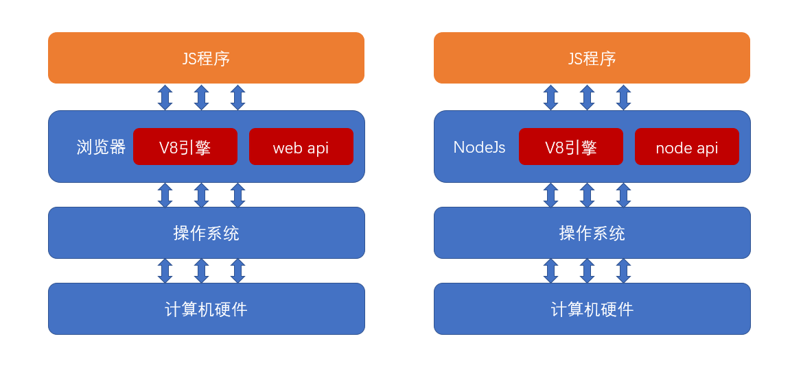
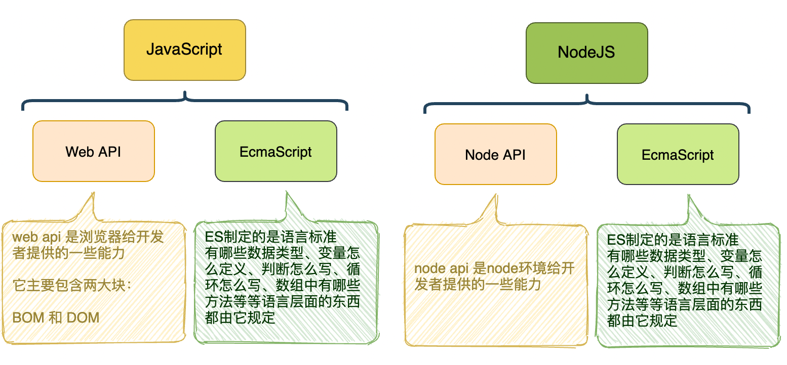
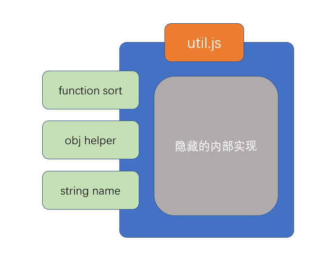
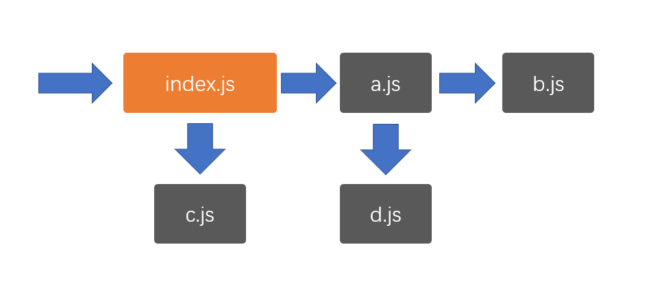

# JavaScript 模块化发展史 {ignore}

## 第一阶段

在 JavaScript 语言刚刚诞生的时候，它仅仅用于实现页面中的一些小效果

那个时候，一个页面所用到的 JS 可能只有区区几百行的代码

在这种情况下，语言本身所存在的一些缺陷往往被大家有意的忽略，因为程序的规模实在太小，只要开发人员小心谨慎，往往不会造成什么问题

在这个阶段，也不存在专业的前端工程师，由于前端要做的事情实在太少，因此这一部分工作往往由后端工程师顺带完成

第一阶段发生的大事件：

- 1996年，NetScape将JavaScript语言提交给欧洲的一个标准制定阻止ECMA（欧洲计算机制造商协会）
- 1998年，NetScape在与微软浏览器IE的竞争中失利，宣布破产

## 第二阶段

ajax的出现，逐渐改变了 JavaScript 在浏览器中扮演的角色。现在，它不仅可以实现小的效果，还可以和服务器之间进行交互，以更好的体验来改变数据

JS代码的数量开始逐渐增长，从最初的几百行，到后来的几万行，前端程序逐渐变得复杂

后端开发者压力逐渐增加，致使一些公司开始招募专业的前端开发者

但此时，前端开发者的待遇远不及后端开发者，因为前端开发者承担的开发任务相对于后端开发来说，还是比较简单的，通过短短一个月的时间集训，就可以成为满足前端开发的需要

究其根本原因，是因为前端开发还有几个大的问题没有解决，这些问题都严重的制约了前端程序的规模进一步扩大：

1. **浏览器解释执行JS的速度太慢**
2. **用户端的电脑配置不足**
3. 更多的代码带来了全局变量污染、依赖关系混乱等问题

上面三个问题，就像是阿喀琉斯之踵，成为前端开发挥之不去的阴影和原罪。

在这个阶段，前端开发处在一个非常尴尬的境地，它在传统的开发模式和前后端分离之间无助的徘徊

第二阶段的大事件：

1. IE浏览器制霸市场后，几乎不再更新
2. ES4.0流产，导致JS语言10年间几乎毫无变化
3. 2008年ES5发布，仅解决了一些 JS API 不足的糟糕局面

## 第三阶段

时间继续向前推移，到了2008年，谷歌的 V8 引擎发布，将JS的执行速度推上了一个新的台阶，甚至可以和后端语言媲美。

摩尔定律持续发酵，个人电脑的配置开始飞跃

突然间，制约前端发展的两大问题得以解决，此时，只剩下最后一个问题还在负隅顽抗，即**全局变量污染和依赖混乱**的问题，解决了它，前端便可以突破一切障碍，未来无可限量。

于是，全世界的前端开发者在社区中激烈的讨论，想要为这个问题寻求解决之道......

2008年，有一个名叫 Ryan Dahl 小伙子正在为一件事焦头烂额，它需要在服务器端手写一个高性能的web服务，该服务对于性能要求之高，以至于目前市面上已有的web服务产品都满足不了需求。

经过分析，它确定，如果要实现高性能，那么必须要尽可能的减少线程，而要减少线程，避免不了要实用异步的处理方案。

一开始，他打算自己实用C/C++语言来编写，可是这一过程实在太痛苦。

就在他一筹莫展的时候，谷歌 V8 引擎的发布引起了他的注意，他突然发现，JS不就是最好的实现web服务的语言吗？它天生就是单线程，并且是基于异步的！有了V8引擎的支撑，它的执行速度完全可以撑起一个服务器。而且V8是鼎鼎大名的谷歌公司发布的，谷歌一定会不断的优化V8，有这种又省钱又省力的好事，我干嘛还要自己去写呢？

于是，它基于开源的V8引擎，对源代码作了一些修改，便快速的完成了该项目。

2009年，Ryan推出了该web服务项目，命名为nodejs。

从此，JS第一次堂堂正正的入主后端，不再是必须附属于浏览器的“玩具”语言了。

也是从此刻开始，人们认识到，JS（ES）是一门真正的语言，它依附于运行环境（运行时）（宿主程序）而执行



nodejs的诞生，便把JS中的最后一个问题放到了台前，即**全局变量污染和依赖混乱**问题

要直到，nodejs是服务器端，如果不解决这个问题，分模块开发就无从实现，而模块化开发是所有后端程序必不可少的内容

经过社区的激烈讨论，最终，形成了一个模块化方案，即鼎鼎大名的CommonJS，该方案，彻底解决了全局变量污染和依赖混乱的问题

该方案一出，立即被nodejs支持，于是，nodejs成为了第一个为JS语言实现模块化的平台，为前端接下来的迅猛发展奠定了实践基础

该阶段发生的大事件：

- 2008年，V8发布
- IE的市场逐步被 firefox 和 chrome 蚕食，现已无力回天
- 2009年，nodejs发布，并附带commonjs模块化标准

## 第四阶段

CommonJS的出现打开了前端开发者的思路

既然后端可以使用模块化的JS，作为JS语言的老东家浏览器为什么不行呢？

于是，开始有人想办法把CommonJS运用到浏览器中

可是这里面存在诸多的困难（课程中详解）

办法总比困难多，有些开发者就想，既然CommonJS运用到浏览器困难，我们干嘛不自己重新定一个模块化的标准出来，难道就一定要用CommonJS标准吗？

于是很快，AMD规范出炉，它解决的问题和CommonJS一样，但是可以更好的适应浏览器环境

相继的，CMD规范出炉，它对AMD规范进行了改进

这些行为，都受到了ECMA官方的密切关注......

2015年，ES6发布，它提出了官方的模块化解决方案 —— ES6 模块化

从此以后，模块化成为了JS本身特有的性质，这门语言终于有了和其他语言较量的资本，成为了可以编写大型应用的正式语言

于此同时，很多开发者、技术厂商早已预见到JS的无穷潜力，于是有了下面的故事

- 既然JS也能编写大型应用，那么自然也需要像其他语言那样有解决复杂问题的开发框架
  - Angular、React、Vue等前端开发框架出现
  - Express、Koa等后端开发框架出现
  - 各种后端数据库驱动出现
- 要开发大型应用，自然少不了各种实用的第三方库的支持
  - npm包管理器出现，实用第三方库变得极其方便
  - webpack等构建工具出现，专门用于打包和部署
- 既然JS可以放到服务器环境，为什么不能放到其他终端环境呢？
  - Electron发布，可以使用JS语言开发桌面应用程序
  - RN和Vuex等技术发布，可以使用JS语言编写移动端应用程序
  - 各种小程序出现，可以使用JS编写依附于其他应用的小程序
  - 目前还有很多厂商致力于将JS应用到各种其他的终端设备，最终形成大前端生态

> 可以看到，模块化的出现，是JS通向大型应用的基石，学习好模块化，变具备了编写大型应用的基本功。

# 为什么需要模块化

当前端工程到达一定规模后，就会出现下面的问题：

- 全局变量污染

- 依赖混乱

上面的问题，共同导致了**代码文件难以细分**

模块化就是为了解决上面两个问题出现的

模块化是针对于JavaScript程序做一种模式拆分

模块化出现后，我们就可以把臃肿的代码细分到各个小文件中，便于后期维护管理

# 模块化标准


- AMD规范 define()定义一个模块，require()加载一个模块 -> requirejs
- CMD规范 define()定义一个模块，require()加载一个模块 -> seaJS
- CommonJS，简称CMJ，这是一个**社区**规范，出现时间较早，目前仅node环境支持，依赖类型：动态依赖
- ES Module，简称ESM，这是随着ES6发布的**官方**模块化标准，目前浏览器和新版本node环境均支持，依赖类型：静态依赖，动态依赖

> 静态依赖：在运行代码之前就要分析出依赖关系，代码还没有运行，就要知道某个模块依赖哪些模块，
> 动态依赖：在代码运行过程中，比如说一个判断，循环，函数，执行了代码里面的内容时，才会导入别的东西。不运行代码时不知道依赖关系的。动态依赖是同步执行的。

> node环境
>
> 下载地址：https://nodejs.org/zh-cn/
>
> 
> 浏览器运行的是html页面，并加载页面中通过script元素引入的js
> nodejs直接运行某个js文件，该文件被称之为入口文件
> nodejs遵循EcmaScript标准，但由于脱离了浏览器环境，因此：
> 1. 你可以在nodejs中使用EcmaScript标准的任何语法或api，例如：循环、判断、数组、对象等
> 2. 你不能在nodejs中使用浏览器的 web api，例如：dom对象、window对象、document对象等
> 由于大部分开发者是从浏览器端开发转向nodejs开发的，为了降低开发者的学习成本，nodejs中提供了一些和浏览器web api同样的对象或函数，例如：console、setTimeout、setInterval等


认识两个重要的概念：**模块的导出**和**模块的导入**

## 模块的导出

要理解模块的导出，首先要理解模块的含义

什么是模块？

模块就是一个JS文件，它实现了一部分功能，并隐藏自己的内部实现，同时提供了一些接口供其他模块使用

模块有两个核心要素：**隐藏**和**暴露**

隐藏的，是自己内部的实现

暴露的，是希望外部使用的接口

任何一个正常的模块化标准，都应该默认隐藏模块中的所有实现，而通过一些语法或api调用来暴露接口

**暴露接口的过程即模块的导出**



## 模块的导入

当需要使用一个模块时，使用的是该模块暴露的部分（导出的部分），隐藏的部分是永远无法使用的。

**当通过某种语法或api去使用一个模块时，这个过程叫做模块的导入**


## AMD

全称是Asynchronous Module Definition，即异步模块加载机制

requireJs是AMD规范最好的实现者之一

通过define函数定义，第一个参数是依赖的文件，采取依赖前置


在AMD中，导入和导出模块的代码，都必须放置在define函数中

```js
define([依赖的模块列表], function(模块名称列表){
    //模块内部的代码
    return 导出的内容
})
```

## CMD

全称是Common Module Definition，公共模块定义规范

sea.js实现了CMD规范

在CMD中，导入和导出模块的代码，都必须放置在define函数中

```js

define(function(require, exports, module){
    //模块内部的代码
})

```


## CommonJS

commenJS规范：规定了一个文件就是模块，module这个变量就代表当前模块,这个变量是一个对象,这个对象上的exports属性(module.exports)就是模块对外输出的一个接口,我们加载一个模块就是加载这个模块的module.exports属性

CommonJS使用```exports```导出模块，```require```导入模块

具体规范如下：

1. 如果一个JS文件中存在```exports```或```require```，该JS文件是一个模块
2. 模块内的所有代码均为隐藏代码，包括全局变量、全局函数，这些全局的内容均不应该对全局变量造成任何污染
3. 如果一个模块需要暴露一些API提供给外部使用，需要通过```exports```导出，```exports```是一个空的对象，你可以为该对象添加任何需要导出的内容
4. 如果一个模块需要导入其他模块，通过```require```实现，```require```是一个函数，传入模块的路径即可返回该模块导出的整个内容

node天生支持CommonJS模块化标准

在nodejs中，由于有且仅有一个入口文件（启动文件），而开发一个应用肯定会涉及到多个文件配合，因此，nodejs对模块化的需求比浏览器端要大的多



由于nodejs刚刚发布的时候，前端没有统一的、官方的模块化规范，因此，它选择使用社区提供的CommonJS作为模块化规范

node规定：

1. node中的每个js文件都是一个CMJ模块，通过node命令运行的模块，叫做入口模块

    也就是如果在终端运行 `node index.js` `index.js` 就是入口模块

2. 模块中的所有全局定义的变量、函数，都不会污染到其他模块
   
   形成单独的作用域，代码之间互不影响

3. 当一个模块需要给其他模块提供一些变量时，用 `module.exports` 导出

4. 模块可以暴露（导出）一些内容给其他模块使用，需要暴露什么内容，就在模块中给`module.exports`赋值 或者 给`exports`对象添加某个属性

    ```js
    function isOdd(n) {
        return n % 2 !== 0;
    }

    function sum(a, b) {
        return a + b;
    }

    module.exports = {
        isOdd,
        sum,
    }
    ```

    ```js
    var boy = 'liuyang'
    exports.boy = boy;
    ```

5. 一个模块可以导入其他模块，使用函数`require("要导入的模块路径")`即可完成，该函数返回目标模块的导出结果

   1. 导入js文件时.js可以省略, 默认加载以.js结尾的文件
   2. 导入模块时，必须以`./`或`../`开头
   3. 没有扩展名，文件类型加载顺序.js > json > .node;
   4. 所以其他不是js文件类型的文件， 加载时最好加上扩展名提高性能
   5. 在node项目中，原生模块和文件模块在同一个项目里面会进行缓存，原生模块在启动的时候就已经加载了，文件模块，分为3类，以后缀名区分 .js，.node，.json
   6. 为了保证高效的执行，仅加载必要的模块。nodejs只有执行到```require```函数时才会加载并执行模块
   7. require的是一个文件夹而没有指明文件名时，就会默认require该文件夹下的index.js文件
   8. require加载顺序：缓存模块>核心模块>用户模块>第三方模块 (不确定对不对)
   
      ```js
      // 1..和. / 当前文件夹
      // 2...和.. / 上一级
      // 3. / 磁盘根目录
      const foo = require('./foo.js'); //加载当前文件夹下的foo.js
      const foo = require('../foo.js'); //加载上一级目录下的foo.js
      const foo = require('/foo.js'); //加载当前C盘根目录下的foo.js
      ```

      ```js
      const foo = require('./foo');
      //等同于
      const foo = require('./foo.js');
      ```


      ```js
      const { isOdd, sum } = require('./math');
      const math = require('./math');
      console.log(math.isOdd(3));
      console.log(isOdd(4));
      ```

      ```js
      var { boy, girl } = require('模块路径')
      ```

6. 模块有缓存。模块可以多次加载，但是只会在第一次加载时（也就是第一次被导入时）运行一次，然后它的导出结果会被node缓存起来，后续对该模块导入时，不会重新运行，直接使用缓存结果。

   ```js
    // 多次 require math.js 文件， math.js 文件只会在第一次 require 的时候执行，后面的 require 都是用的第一次 require 结果的缓存
    require('./math');
    require('./math');
    require('./math');
    require('./math');
    require('./math');
   ```
7. 为了隐藏模块中的代码，nodejs执行模块时，会将模块中的所有代码放置到一个函数中执行，以保证不污染全局变量。 (这一点不是很懂其实)
   ```js
    (function(){
        //模块中的代码
    })()
   ```

### module.exports 和 exports

+ module 是一个对象
    ```js
    Module {
      // module.id 模块的识别符，通常是带有绝对路径的模块文件名。
      id: '.',
      path: 'C:\\Users\\Lmljhlb\\Desktop\\es6',
      // module.exports  模块对外输出的接口, 默认值是一个{}
      exports: { counter: [Function: counter], start: [Function: start], num: 145 },
      // module.parent 返回一个对象，表示调用该模块的模块。
      parent: null,
      // module.filename 模块名称，一般是个绝对路径
      filename: 'C:\\Users\\Lmljhlb\\Desktop\\es6\\counter.js',
      // module.loaded 返回一个布尔值，表示模块是否已经完成加载。
      loaded: false,
      // module.children 返回一个数组，表示该模块要用到的其他模块。
      children: [],
      // module.paths 模块路径
      paths: [
        'C:\\Users\\Lmljhlb\\Desktop\\es6\\node_modules',
        'C:\\Users\\Lmljhlb\\Desktop\\node_modules',
        'C:\\Users\\Lmljhlb\\node_modules',
        'C:\\Users\\node_modules',
        'C:\\node_modules'
      ]
    }
    ```

+ module.exports和exports的区别
  + 为了保证顺利的导出模块内容，nodejs做了以下处理
    + 在模块开始执行前，初始化一个值```module.exports = {}```
    + ```module.exports```即模块的导出值
    + 为了方便开发者便捷的导出，nodejs在初始化完```module.exports```后，又声明了一个变量```exports = module.exports```
  + module.exports就是模块对外输出的一个接口,我们加载一个模块就是加载这个模块的module.exports属性
  + exports变量，实际上是nodeJS为了方便，为每个模块提供一个exports变量，指向module.exports。
  这等同在每个模块头部，有一行这样的命令：

    ```js
    const exports=module.exports;
    //正确
    let a = 123
    exports.a=a;
    //错误
    exports={
      a
    }
    ```

    ```js
    (function(module){
        module.exports = {};
        var exports = module.exports;
        //模块中的代码
        return module.exports;
    })()
    ```
  + > 注意:
  不能直接将exports变量指向一个值，等于切断了exports与module.exports的联系，
  他将不再是一个接口，而仅仅当前模块中的一个局部变量。

### 原理

**CommonJS的工作原理**

当使用```require(模块路径)```导入一个模块时，node会做以下两件事情（不考虑模块缓存）：

1. 通过模块路径找到本机文件，并读取文件内容
2. 将文件中的代码放入到一个函数环境中执行，并将执行后module.exports的值作为require函数的返回结果

正是这两个步骤，使得CommonJS在node端可以良好的被支持

可以认为，**CommonJS是同步的**，必须要等到加载完文件并执行完代码后才能继续向后执行

**当浏览器遇到CommonJS**

当想要把CommonJS放到浏览器端时，就遇到了一些挑战

1. 浏览器要加载JS文件，需要远程从服务器读取，而网络传输的效率远远低于node环境中读取本地文件的效率。由于CommonJS是同步的，这会极大的降低运行性能
2. 如果需要读取JS文件内容并把它放入到一个环境中执行，需要浏览器厂商的支持，可是浏览器厂商不愿意提供支持，最大的原因是CommonJS属于社区标准，并非官方标准

**新的规范**

基于以上两点原因，浏览器无法支持模块化

可这并不代表模块化不能在浏览器中实现

要在浏览器中实现模块化，只要能解决上面的两个问题就行了

解决办法其实很简单：

1. 远程加载JS浪费了时间？做成异步即可，加载完成后调用一个回调就行了
2. 模块中的代码需要放置到函数中执行？编写模块时，直接放函数中就行了

基于这种简单有效的思路，出现了AMD和CMD规范，有效的解决了浏览器模块化的问题。

```js
// require 函数伪代码
function require(path) {
  if (该模块有缓存吗) {
    return 缓存结果;
  }

  // 如果没有缓存
  function _run(exports, require, module, __filename, __dirname) {
    // 模块代码放这里
    // 因为模块代码都在函数里面运行，所以不会污染全局
  }

  var module = {
    exports: {}
  }

  // 调用函数
  _run.call(
    module.exports,
    module.exports,
    require,
    module,
    模块路径,
    模块所在目录
  );

  把 module.exports 加入到缓存中
  return module.exports;
}
```

```js
// index.js
console.log(arguments.length) // 5
```

所以在commonjs中每个模块在运行前，this，exports，module.exports 指向的是同一个地址

题1:

```js
// m.js
this.a = 1;
this.b = 2;
```

```js
import m = require('./m.js');
console.log(m); {a: 1, b: 2};
```

题2:
```js
exports.a = 1;
module.exports.b = 'b';
this.c = 'c';
module.exports = {
  d: 'd',
}
```

```js
import m = require('./m.js');
console.log(m); {d: 'd'};
```


### 练习题

#### 导入导出练习

按照要求完成下面的模块

**1. 配置模块 config.js**

它需要导出一个对象，规格如下：

```js
module.exports = {
    wordDuration: 300, // 打印每个字的时间间隔
    text: `西风烈，
        长空雁叫霜晨月。
        霜晨月，
        马蹄声碎，
        喇叭声咽。
        雄关漫道真如铁，
        而今迈步从头越。
        从头越，
        苍山如海，
        残阳如血。` // 要打印的文字
}

```

**2. 延迟模块 delay.js**

该模块的文件名为`delay`，你需要把下面的函数导出：

```js
/**
 * 该函数返回一个Promise，它会等待指定的毫秒数，时间到达后该函数完成
 * @param {number} ms 毫秒数
 * @returns {Promise}
 */
function delay(ms) {
  return new Promise((resolve) => setTimeout(resolve, ms));
}

module.exports = delay;

```

**3. 打印模块 print.js**

该模块负责导出一个打印函数，该函数需要获取当前的打印配置：

```js
/**
 * 该函数会做以下两件事：
 * 1. console.clear() 清空控制台
 * 2. 读取config.js中的text配置，打印开始位置到index位置的字符
 * @param {number} index 
 */
const config = require('./config.js')
function print(index){
    console.clear();
    const txt = config.text.substring(0, index + 1);
    console.log(txt);
    return txt;
}

module.exports = print;
```

**4. 主模块 main.js**

这是启动模块，它会利用其它模块，逐字打印出所有的文本，打印每个字的间隔时间在`config.js`中已有配置

```js
/**
 * 运行该函数，会逐字打印config.js中的文本
 * 每个字之间的间隔在config.js已有配置
 */
const delay = require('./delay.js');
const config = require('./config.js');
const print = require('./print.js');

async function run() {
    for(let i = 0; i < config.text.length; i ++) {
        await delay(config.wordDuration);
        console.log(print(i))
    }
}

async function run() {
  let index = 0;
  while (index < config.text.length) {
    print(index); // 打印到这个位置
    await delay(config.wordDuration);
    index++;
  }
}

run();
```

# ES Module

ECMA组织参考了众多社区模块化标准，终于在2015年，随着ES6发布了官方的模块化标准，后成为ES6模块化

ES6模块化具有以下的特点

1. 使用依赖**预声明**的方式导入模块
   1. 依赖延迟声明
      1. 优点：某些时候可以提高效率
      2. 缺点：无法在一开始确定模块依赖关系（比较模糊）
   2. 依赖预声明
      1. 优点：在一开始可以确定模块依赖关系
      2. 缺点：某些时候效率较低
2. 灵活的多种导入导出方式
3. 规范的路径表示法：所有路径必须以./或../开头

过去在浏览器中引用js

```js
// index.js
var a = 123;
```

```html
<script src="./index.js"></script>
<script>
    // 会污染全局变量
    console.log(a); // 123
    console.log(window.a); // 123
</script>
```

用 ES Module 的方式引入js

**注意：这一部分非模块化标准**

```js
// index.js
var a = 123;
```

```html
<!-- src 是 入口文件 ，type 属性值是 module -->
<script src="./index.js" type="module" ></script>
<script>
    console.log(a); // Uncaught ReferenceError: a is not defined
    console.log(window.a); // undefined
</script>
```

## 如何导出

**ES Module**的导出

ES Module分为两种导出方式：

- 具名导出（普通导出），可以导出多个
- 默认导出，只能导出一个

基本导出的语法如下：

```js
export 声明表达式
```

或

```js
export {具名符号}
```

一个模块可以同时存在两种导出方式，最终会合并为一个「对象」导出

```js
export const a = 1; // 具名，常用
export function b() {} // 具名，常用
export const c = () => {}  // 具名，常用
const d = 2;
export { d } // 具名
const k = 10
export { k as temp } // 具名

// export default 3 // 默认，常用
// export default function() {} // 默认，常用
// const e = 4;
// export { e as default } // 默认

const f = 4, g = 5, h = 6
export { f, g, h as default} // 基本 + 默认

// 以上代码将导出下面的对象
/*
{
	a: 1,
	b: fn,
	c: fn,
	d: 2,
	temp: 10,
	f: 4,
	g: 5,
	default: 6
}
*/
```

## 如何导入

由于使用的是**依赖预加载**，因此，导入任何其他模块，导入代码必须放置到所有代码之前
针对具名导出和默认导出，有不同的导入语法
模块路径可以是绝对路径，也可以是相对路径，文件名不能省略后缀
导入结果也是有缓存的
import 后面的 {} 是导入语法，和解构赋值不是一回事儿

注意以下细节：
- 导入时，可以通过关键字```as```对导入的符号进行重命名
- 导入时使用的符号是常量，不可修改
- 可以使用*号导入所有的基本导出，如果使用*号，会将所有基本导出和默认导出聚合到一个对象中

```js
// 仅运行一次该模块，不导入任何内容
import "模块路径"
// 常用，导入属性 a、b，放到变量a、b中。a->a, b->b
import { a, b } from "模块路径"   
// 常用，导入属性 default，放入变量c中。default->c
import c from "模块路径"  
// 常用，default->c，a->a, b->b
import c, { a, b } from "模块路径" 
// 常用，将模块对象放入到变量obj中
import * as obj from "模块路径" 


// 导入属性a、b，放到变量temp1、temp2 中
import { a as temp1, b as temp2 } from "模块路径" 
// 导入属性default，放入变量a中，default是关键字，不能作为变量名，必须定义别名
import { default as a } from "模块路径" 
//导入属性default、b，放入变量a、b中
import { default as a, b } from "模块路径" 
// 以上均为静态导入

import("模块路径") // 动态导入，返回一个Promise，完成时的数据为模块对象
```

**注意：静态导入的代码必须为在代码顶端，也不可放入代码块中。也就是不可以放到循环，判断，函数体里面。但是CMJ可以**

**另外，静态导入的代码绑定的符号是常量，不可更改**

## 练习题

导出两个函数 sum，isOdd

```js
export function sum() {};
export function isOdd() {};
```

```js
function sum() {};
function isOdd() {};
export { sum, isOdd }
```

```js
function sum() {};
function isOdd() {};
export default { sum, isOdd }
```

```js
export default {
    sum() {},
    isOdd() {}
}
```

动态导入

```js
// math.js
export default {
    sum() {},
    isOdd() {}
}
```

```js
setTimeout(async () => {
  const m = await import('./math.js');
  const math = m.default;
  const result = math.isOdd(1, 2);
  console.log(result);
}, 1000);
```

输出结果

```js
// a.js
var count = 1;
export {count};
export function increase() {
  count ++;
}
```

```js
// index.js
import {count, increase} from './a.js';
import * as counter from 'a.js';
const {count: c} = counter;
increase();
console.log(count); // 2
console.log(counter.count); // 2
console.log(c); // 1
```

## ES6模块化的其他细节

1. **尽量导出不可变值**

当导出一个内容时，尽量保证该内容是不可变的（大部分情况都是如此）

因为，虽然导入后，无法更改导入内容，但是在导入的模块内部却有可能发生更改，这将导致一些无法预料的事情发生

2. **可以使用无绑定的导入用于执行一些初始化代码**

如果我们只是想执行模块中的一些代码，而不需要导入它的任何内容，可以使用无绑定的导入：

```js
import "模块路径"
```

3. **可以使用绑定再导出，来重新导出来自另一个模块的内容**

有的时候，我们可能需要用一个模块封装多个模块，然后有选择的将多个模块的内容分别导出，可以使用下面的语法轻松完成

```js
export {绑定的标识符} from "模块路径"
```

```js
// import { a, b } from "./m1.js";
// import m2, { k } from "./m2.js"

// export { a, b, k, m2 as default }

export { a, b } from "./m1.js"
export { k, default, a as m2a } from "./m2.js"
export const r = "m-r"
```

4. 符号绑定

```js
// a.js
export default 'a';
export var count = 0;
export function increase() {
  count ++;
}
```

```js
// index.js
import {conut, increase} from './a.js';
console.log(count); // 0
increase();
console.log(count); // 1 -> 说明 a.js 和 index.js 中的 count 用的同一个内存空间，就是同一个值
```

5. commonjs 和 es6 模块的区别是什么？
   1. CMJ 是社区标准，ESM 是官方标准
   2. CMJ 是使用 API 实现的模块化，ESM 是使用新语法实现的模块化
   3. CMJ 仅在 node 环境中支持，ESM 在各种环境均支持
   4. CMJ 是动态依赖，同步执行。ESM 既支持动态也支持静态，ESM 的动态依赖是异步执行的
   5. ESM 导入时有符号绑定，CMJ 只是普通函数调用和赋值


6. export 和 export default 的区别是什么？
   1. export 为普通导出，又叫具名导出，它导出的数据必须带有命名，比如变量定义、函数定义这种带有命名的语句。在导出的模块对象中，命名即为模块对象的属性名。在一个模块中可以有多个具名导出
   2. export default 为默认导出，在模块对象中名称固定为 default，因此无需命名，通常导出一个表达式或字面量。在一个模块中只能有一个默认导出


npm官网：https://www.npmjs.com/

npm全命令：https://docs.npmjs.com/cli/v7/commands

# 包概念（package）

1. 什么是**包**？

   包（package）是一个或多个js模块的集合，它们共同完成某一类功能

   可以简单的认为每一个工程就是一个包

   有些包是为了给别人用的，这种包也叫第三方库

2. 什么是**包管理器**？

   包管理器是一个管理包的工具，前端常见的包管理器有npm、yarn、cnpm、pnpm等

   包管理器具备以下能力：

   - 让开发者可以轻松的下载包
   - 让开发者可以轻松的升级和卸载包
   - 能够自动管理包的依赖

3. 什么是**cli**

   cli是一个命令行工具，它提供一个终端命令，通过该命令可以完成一些功能

# 配置源

## 查看源

```shell
npm config get registry
```

## 配置淘宝镜像源

```shell
npm config set registry https://registry.npm.taobao.org
```

## 配置官方源

```shell
npm config set registry https://registry.npmjs.org/
```

# 初始化一个工程

```shell
npm init # 初始化工程，帮助生成 package.json 文件
npm init -y # 初始化工程，全部使用默认配置生成 package.json 文件
```

## package.json

https://docs.npmjs.com/cli/v9/configuring-npm/package-json

```json
{
    // scripts 脚本里面，访问我们当前配置文件信息的需求
    // 如果命令行有一个命令是 echo hello 
    // 就可以这样写script字段, 然后在终端运行 npm run dev 就会执行 echo hello 
    // 因为 dev 是自定义的脚本，所以执行的时候，需要npm run
    // 例如 start 、test  就不需要写 run
    "scripts" : {
        "dev" : "echo hello",
        "build": "echo $npm_package_config_env",
        "start" : "node ./index.js"
    },
    "dependencies": { // 项目上线之后，产品运行需要的依赖
        "qrcode": "^1.4.4" // 依赖包qrcode，版本1.4.4，主版本号不变，此版本号和补丁版本可增
    },
    "devDenpendencies": { // 开发依赖，仅在开发时需要，上线之后就不需要了
        "webpack": "^5.0.0" 
    },
    "config": {
        "dev" : "echo hello"
    },
    "name": "foo"
}
```


## 安装第三方包

Node使用npm(Node Package Manager)安装的第三方模块

npm 的安装机制

1. npm 会检查本地的 node_modules 目录中是否已经安装过该模块，如果已经安装，则不再重复安装
2. npm 检查缓存中是否有相同模块，如果有，直接从缓存中读取安装
3. 如果本地和缓存中均不存在，npm 会从 registry 指定的地址下载安装包，然后将其写入(可以说是下载到)到本地的 node_modules 目录中，同时缓存起来

+ 线上环境需要的依赖（正式环境）package.json -> dependencies(是一个对象，属性名是模块名，属性值是版本号)
    ```shell
    # 下面的 install 可以替换为 i
    npm install 模块名 --save
    # 或者
    npm i 模块名 -S #(大写)
    # 或者
    npm install 模块名
    # 或者
    npm install 模块名@版本号
    ```
      
+ 开发环境需要的依赖  devDependencies(是一个对象，属性名是模块名，属性值是版本号)
    ```shell
    # 下面的 install 可以替换为 i
    npm install 模块名 --save-dev  
    # 或者
    npm i 模块名 -D #(大写)
    # 或者
    npm install -D 包名@版本号
    ```
      
+ 全局安装
  ```shell
  # 下面的 install 可以替换为 i
  npm install -g 模块名
  npm install -g 模块名@版本号
  ```

## 引入第三方模块

```js
const http = require('gulp');
```

引入时，第三方模块查找机制：

1. 在当前文件夹下的 node_modules 文件夹下找对应的包名

2. 找包里面的package.json文件

3. 找package.json文件中的main属性，执行main属性对应的值，返回该模块

4. 如果找不到package.json文件或者package.json文件中没有main属性，node默认找index.js文件，作为入口文件

5. 如果没有index.js文件，node会返回当前文件夹的上一级，重复1，2，3，4，如果还是找不到，逐级往上找，直到找到当前的磁盘根目录，例如：C盘 ,找到就返回这个模块，如果还找不到，就会到path路径中找，找到返回，找不到报错！

在node中引入模块查找机制，因为node中有内置模块：

```js
require("a")
```

1. 查找是否有内置模块a
2. 查找当前目录的node_modules中是否有a
3. 依次查找上级目录的node_modules中是否有a，直到根目录

## 其他操作

+ 还原安装
  
  ```shell
  # 下面的 install 可以替换为 i
  npm install
  npm install --production # 仅还原dependencies中的依赖
  ```

+ 卸载
  + 本地卸载
    ```shell
    # 下面的 uninstall 均可替换为 un
    npm uninstall 包名
    ```
  + 全局卸载
    ```shell
    # 下面的 uninstall 均可替换为 un
    npm uninstall -g 包名
    ```
+ npm 缓存
  ```shell
  # 清除缓存
  npm cache clean -f

  # 获取缓存位置
  npm config get cache

  # 设置缓存位置
  npm config set cache "新的缓存路径"
  ```
+ 查看包信息
  + 查看包所有的版本
  
    ```shell
    # view 可以替换为 v
    npm view 包名 versions
    ```

# 练习1：全局安装练习

1. 全局安装`moeda`
2. 运行命令`moeda 1 cny`，查看当前人民币汇率

# 练习2：开发流程练习

1. 创建一个工程，名为`qr-shower`

2. 使用git初始化 `git init`

3. 使用npm初始化 `npm init -y`

4. 添加.gitignore文件，内容如下：

   ```
   node_modules
   .DS_Store // 是苹果电脑才有用的
   ```

5. git提交：init proj

6. 关联并推送到gitee

7. 新建`index.js`
   ```js
    // index.js
    console.log("这里是index.js")
   ```

8. 设置`package.json`的脚本`start`，用于运行`index.js`命令
   ```json
    {
        "scripts": {
            "start": "node index.js"
        }
    }
   ```

9.  安装`qrcode`

10. 编写下面的代码

    ```js
    var QRCode = require('qrcode');
    
    QRCode.toString('I am a pony!', { type: 'terminal' }, function (err, data) {
      console.log(data);
    });
    ```

11. 运行脚本`npm start`，查看效果

12. 开发完成，提交，然后推送到gitee

13. 删除本地工程

14. 从gitee拉取工程

15. 还原依赖

16. 重新运行

# npx
## 运行本地命令

使用 `npx 命令` 时，它会首先从本地工程的 `node_modules/.bin` 目录中寻找是否有对应的命令

例如：

```shell
npx webpack
# 等同于
node_modules/.bin/webpack
```

上面这条命令寻找本地工程的 `node_modules/.bin/webpack`

如果将命令配置到 `package.json` 的 `scripts` 中，可以省略 `npx`

```json
{
  "scripts": {
    "build": "webpack",
  }
}
```

如果我在终端输入 `npm run build` 相当于执行 `npx webpack`


## 临时下载执行

当执行某个命令时，如果无法从本地工程中找到对应的命令，则会把命令对应的包下载到一个临时目录，下载完成后执行，临时目录中的命令会在适当的时候删除

例如：

当前有一个json文件

```json
{
  "a": 1,
  "b": 2,
}
```

想把这个json转换成另一种格式，可以用 prettyjson 工具

```shell
npx prettyjson 1.json
```

npx 会下载 `prettyjson` 包到临时目录，这个临时目录根据操作系统不同可能不一样，然后运行该命令，也就是 `prettyjson`，然后等到合适的时间把这个包删掉

如果命令名称和需要下载的包名不一致时，可以手动指定包名

例如 `@vue/cli` 是包名，`vue` 是命令名，两者不一致，可以使用下面的命令

```shell
# -p @vue/cli -> -p 是 package，指定包的名字是 @vue/cli
npx -p @vue/cli vue create vue-app
```

小工具 create-vite

```shell
npx create-vite proj
# 等效于
npm init vite proj3
```


## cross-env

### cross-env是什么

运行跨平台设置和使用环境变量脚本

### 出现原因

当使用 NODE_ENV=production， 来设置环境变量时，大多数 Windows 命令提示将会阻塞（报错）。（异常是 Windows 上的 Bash，他是用本机 Bash）。换言之，Windows 不支持 NODE_DEV=production 的设置方式。

### 解决

cross-env 使得开发者可以使用单个命令，而不必担心平台正确设置或使用环境变量。这个迷你的包（cross-env）能够提供一个设置环境变量的 scripts，让你能够以 Unix 方式设置环境变量，然后在 Windows 上也能兼容运行。

### 安装

npm i -D cross-env

# ESLint

> ESLint 的官网： https://eslint.org/
> 民间中文网：https://eslint.bootcss.com/

npm i -D eslink-config-airbnb

安装 eslink-config-airbnb 不用安装 eslink，eslink-config-airbnb 会自动安装 eslint

```json
{
    // 表示继承 airbnb 的规则
    "extends": "airbnb"
}
```