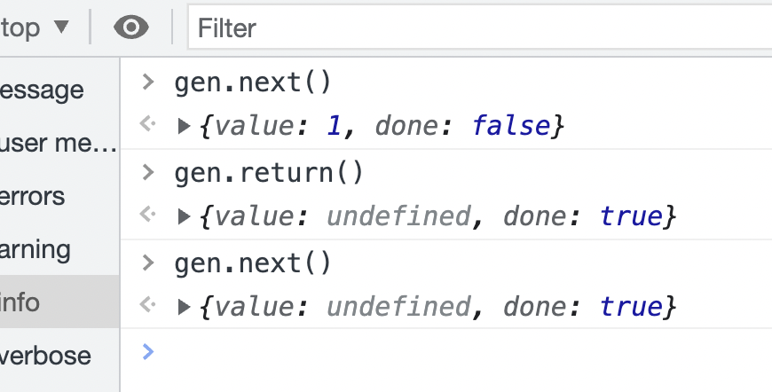

# promise

### promise是什么？

promise：是一个构造函数，用new来调用，

可以看做一个密闭的容器，内部封装异步的操作并可以获取其结果

#### 异步操作有哪些？

setTimeout setInterval ajax 图片加载 文件操作

### promise 解决什么问题？

回调地域问题（回调函数的深层嵌套），不便于阅读，不便于异常处理, 每一个函数都要处理一下异常

回调函数嵌套调用，外部回调函数异步执行的结果是嵌套的回调函数执行的条件


promise链式调用 ---> async / await

## 状态
### pending  fulfilled  rejected


状态的改变是单向的，不可逆的
```js
// 参数是一个回调函数，回调函数有两个参数，第一个是解决，第二个拒绝
// 这个回调函数是一个同步函数，异步方法写在这个函数里面

new Promise ((resolve, reject) => {
    // 延时器相当于一个异步方法
    
    setTimeout(() => {
      resolve();  
    },)
})

new Promise ((resolve, reject) => {
    resolve();
    reject();  
    //只会执行第一个
})
```

```js
console.log(
    new Promise((resolve, reject) =>{
        reject('拒绝状态');
    }).then(value => {
        console.log(value);
    }, reason => {
        console.log(reason);
    })
)

// then 如果返回一个值的话，下一个then的会接收，返回一个promise的话，由这个promise调用下一个then
```

### promise 状态改变

pending ---> fulfilled

pending ---> rejected

`Promise`对象的状态改变，只有两种可能：从`pending`变为`fulfilled`和从`pending`变为`rejected`。只要这两种情况发生，状态就凝固了，不会再变了，会一直保持这个结果，这时就称为 resolved（已定型）。

在es6中，为了行文方便，promise那一章后面的`resolved`统一只指`fulfilled`状态，不包含`rejected`状态。所以有时候也会用resolved 表示已解决

### promise 的原型对象（实例）方法

```js
let p1 = new Promise(); 
p1.then();
p1.catch(error => {}); // error 是接收的失败的信息
p1.fanally();   // 不管成功，失败，都会触发
```


```js
new Promise((res, rej) => {
    rej('失败了')
}).catch(error => {
    console.log(error) // '失败了'
})
```

#### Promise.prototype.then

#### Promise.prototype.catch

#### Promise.prototype.finally

`finally`方法的回调函数不接受任何参数，这意味着没有办法知道，前面的 Promise 状态到底是`fulfilled`还是`rejected`。这表明，`finally`方法里面的操作，应该是与状态无关的，不依赖于 Promise 的执行结果。


`finally`本质上是`then`方法的特例。

```javascript
promise
.finally(() => {
  // 语句
});

// 等同于
promise
.then(
  result => {
    // 语句
    return result;
  },
  error => {
    // 语句
    throw error;
  }
);
```

上面代码中，如果不使用`finally`方法，同样的语句需要为成功和失败两种情况各写一次。有了`finally`方法，则只需要写一次。

### promise.all()

参数是一个数组，返回值 promise 实例

数组里面的全部 promise 都是 resolve() 才能执行 then ，否则，执行 catch

```js


function water() {
    return new Promise((resolve, reject) => {
        setTimeout(() => {
            resolve()
        })
    })
}

function cut() {
    return new Promise((resolve, reject) => {
        setTimeout(() => {
            resolve()
        })
    })
}

Promise.all([water(), cut()]).then(res= > {
    console.log(res)
}).catch(error => {
    console.log(error);
})
```

```js
Promise.all([axios.get('/banner'), axios.get('/list')]).then(res => {
    res[0] // 轮播图数据
    res[1] // 列表数据
})
```

### Promise.race()

语法同 promise.all() 相同


### Promise.resolve()

```js
const p1 = new Promise((resolve, reject) => {
    resolve(1)
})

const p2 = Promise.resolve(2);
```


### Promise.reject()

```js
const p3 = Promise.reject(3);

p3.catch(reason => {console.log(reason)}) // 3
```


### 任务优先级

同步立刻执行任务
微任务队列  then,改变状态时才会产生微任务
宏任务队列  延时器，定时器


### 宏任务提升原来是误解
```js
let promise = new Promise(resolve => {
    setTimeout(() => {
        console.log('setTimeout');
        resolve();
    }, 1000);
    console.log(1);
}).then(value => console.log('then'));

console.log(2)
```

### 微任务的值如果是一个promise

```js
let p1 = new Promise((resolve, reject) => {
            reject('拒绝')
        })

new Promise((resolve, reject) => {
    setTimeout(() => {
        resolve(p1);
    }, 1000);
    console.log(1);
}).then(
    value => console.log(value),
    error => console.log(error)
);

// 打印顺序 1 拒绝
```

### then的基本语法

#### 没有状态改变一直向后处理
```js
new Promise((resolve, reject) => {
        reject('涨价了，买不起')
    })
    .then()
    .then(
        value => console.log(value),
        error => console.log(error)
    )
    .then(null, error => console.log(error));
```

#### promise.then也是一个promise

<!-- pending状态 -->
```js
let p1 = new Promise((resolve, reject) => {
            reject('拒绝')
})

let p2 = p1.then(
    value => console.log(value),
    error => console.log(error)
)

console.log(p1);
console.log(p2);
```

```js
let p1 = new Promise((resolve, reject) => {
    reject('拒绝')
})

let p2 = p1.then(
    value => console.log(value),
    error => console.log(error)
) //默认状态下，then返回的是成功，可以在then里面自行return 一个promise

setTimeout(() => {
    console.log(p1);  // Promise {<rejected>: "拒绝"}
    console.log(p2);  // Promise {<resolved>: undefined}  默认状态下，then返回的是成功 
});
```

```js
// then默认返回成功
let p1 = new Promise((resolve, reject) => {
    reject('拒绝')
})

let p2 = p1.then(
    value => console.log(value),
    error => 'houdunren'
).then(value => console.log(value))  
console.log(p2);  // Promise {<pending>}  因为then还没有走，所以是pending状态

// 如果创建一个延时器，打印，就是Promise {<resolved>: undefined}
```

#### 返回值如果不是标准的promise 


### 异步加载图片

```js
function loadImg(src) {
    return new Promise((resolve, reject) => {
        const image = new Image();
        image.src = src;
        image.onload = () => { //如果加载成功
            resolve(image); //把图片作为参数传过来，
        }

        image.onerror = reject; //如果加载失败

        document.body.appendChild(image);
    })
}

loadImg('img/a.jpg').then(image => {
    image.style.border = '1px solid #abc';
})
```

### promise 定时器

```js
function timeout(delay = 1000) {
    return new Promise(resolve => setTimeout(resolve, delay))
}
timeout(2000).then(() => {
    console.log('hou');
    return timeout(1000)
}).then(value => {
    console.log(123)
})
```

### 构建扁平化的setInterval
```js
function interval(delay = 1000, callback) {
    return new Promise(resolve => {
        let id = setInterval(() => {
            // console.log(1)
            callback(id, resolve);
        }, delay);
    })
}

interval(100, (id, resolve) => {
    console.log(12);
    // 回调函数里面写要执行的代码
    // 比如修改宽度
    // 因为回调函数在定时器里面一直执行，可以一直加加
    // 如果满足某些条件，清除定时器
    if (width == 100) {
        clearInterval(id);
        resolve(div);
    }
}).then(div => {
    return interval(100, (id, resolve) => {
        console.log(12);
        if (width == 100) {
            clearInterval(id);
            resolve(div);
        }

    })
}).then(div => {
    div.style.color = 'red';
})
```

### promise 队列
每个then返回一个新的promise，并且状态必须发生改变

#### 使用map
```js
function queue(num) {
    let promise = Promise.resolve();
    num.map(v => {
        promise = promise.then(_ => {
            return new Promise(resolve => {
                setTimeout(() => {
                    console.log(v);
                    resolve();
                }, 1000);
            })
        })
    })
}
num = [1, 3, 4, 8, 9]
```

#### 使用reduce
```js
function queue(num) {
    let promise = Promise.resolve();
    num.reduce((promise, n) => {
        return promise.then(_ => {
            return new Promise(resolve => {
                setTimeout(() => {
                    console.log(v);
                    resolve();
                }, 1000);
            })
        })
    }, Promise.resolve())
}
num = [1, 3, 4, 8, 9]
```

### Promise 的封装

```js
calss MyPromise{
    constructor(callback) {
        this.status = 'pending';
        this.val = '';  // 成功的信息
        this.error = ''; // 失败的信息
        // 定义两个函数
        const resolve = (val) => {
            if(this.status === 'pending') {
                this.status = 'resolved';
                this.val = val
            }
            
        }
        
        const reject = (error) => {
            if(this.status === 'pending') {
                this.status = 'rejected';
                this.error = error
            }
            
        }
        
        callback(resolve, reject)
    }
    
    then(onResolveFun, onRejectFun) {
        if(this.status === 'resolved') {
            onResolveFun(this.val)
        } else {
            onRejectFun(this.error)
        }
        
    }
}

let p1 = new MyPeomise((resolve, reject) => {
    reject('失败的信息')
})
```


## async

### async 函数执行 会返回一个promise

### await类似then

```js
async function fun() {
    let name = await new Promise(resolve => {
        setTimeout(() => {
            // 因为await相当于then，如果promise里面没有状态改变，then无法执行，所以打印name没有效果
        }, 1000);
    })
    console.log(name);
}

fun();

async function fun() {
    let name = await new Promise(resolve => {
        setTimeout(() => {
            resolve(123);  // 状态发生改变
        }, 1000);
    })
    console.log(name);  //123
}

fun();
```

### await必须写在async里面
```js
async function sleep(delay = 1000) {
    return new Promise(resolve => {
        setTimeout(() => {
            resolve();
        }, delay);
    })
}

async function show() {
    for (const user of ['123', '456']) {
        await sleep();
        console.log(user);
    }
}

show();
```


## event loop  事件循环

> + js执行机制
>   + 解释性，单线程
> + js 任务
>   + 同步任务
>   + 异步任务
>     + 宏任务 ：setTimeout setInterval
>     + 微任务 ：.then catch finally

#### 规则

遇到同步任务直接执行

遇到宏任务不执行，把它推进宏任务队列

遇到微任务不执行，把它推进微任务队列

等待同步任务全部执行完毕，去执行微任务队列，再等微任务队列执行完毕后，再去宏任务队列里执行相应的宏任务


# js异步编程的方法


+ 回调函数
+ 事件监听
+ Promise
+ Generator
+ async/await


## 同步编程和异步编程的区别

### 同步

同步就是在执行某段代码的时候，在该代码没有得到返回结果之前，其他代码暂时是无法执行的，但是一旦执行完拿到返回值之后，就可以执行其他代码了


### 异步

就是当某一代码执行异步过程调用发出后，这段代码不会立刻得到返回结果。而是在异步调用发出之后，一般通过回调函数处理这个调用之后拿到的结果

异步调用发生之后，不会阻塞后面代码的执行


## js编程中为什么需要异步？

js是单线程的

如果js都是同步代码执行可能会造成阻塞，比如请求数据，数据非常多

使用异步就不会造成阻塞，因为异步不需要等待异步地执行的返回结果，可以继续执行该异步任务之后的代码逻辑


### 回调函数

异步回调如果层级很少，可读性和代码的维护性暂时还是可以接收，一旦层级变多就会陷入回调地域


### Genetator

Generator 最大的特点就是可以交出函数的执行权

Generator 函数可以看出是异步任务的容器需要暂停的地方，都用 yield 语法来标注

Generator 返回迭代器


### async/await

async 是 Generator 函数的语法糖

async / await 的优点是代码清晰

可以处理回调地域的问题

可读性接近同步代码，更容易阅读


| js异步编程方式 | 简单总结                                                  |
| -------------- | --------------------------------------------------------- |
| 回调函数       | 早些年js异步编程采用的方式                                |
| Promise        | es6新增异步编程方式，解决回调地域问题                     |
| Generator      | 和yield配合使用，返回的是迭代器                           |
| async/await    | 二者配合使用，async返回的是promise对象，await控制执行顺序 |


## 如何理解Promise

语法上说，promise是一个对象，从它可以获取异步操作的消息

简单来说，它就是一个容器，里面保存着某个未来才会结束的事件的结果

### promise如何解决回调地域

promise利用三大技术手段来解决回调地域：回调函数延迟绑定、返回值穿透、错误冒泡


```js
readFilePromise('1.json').then(data => {
    return readFilePromise('2.json')
}).then(data => {
    return readFilePromise('3.json')
}).then(data => {
    return readFilePromise('4.json')
}).catch(err => {
    // 前面产生的错误一直被传递，被catch接收到
})
```


### promise 的静态方法

#### Promise.all(iterable)

参数是一个可迭代对象，比如说数组

这个方法对于汇总多个promise的结果很有用

在es6中可以将多个promise.all异步请求并行操作

`Promise.race()`方法的参数与`Promise.all()`方法一样，如果不是 Promise 实例，就会先调用下面讲到的`Promise.resolve()`方法，将参数转为 Promise 实例，再进一步处理。

1. 当所有结果成功返回时按照请求顺序返回成功
2. 当其中有一个方法失败时，进入失败方法


##### 代码示例

```js
// 获取轮播数据列表
function getBannerList() {
    return new Promise((resolve, reject) => {
        setTimeout(function() {
            resolve('轮播数据')
        }, 3000)
    })
}

// 获取店铺列表
function getStoreList() {
    return new Promise((resolve, reject) => {
        setTimeout(function() {
            resolve('店铺数据')
        }, 500)
    })
}

// 获取分类列表
function getCategoryList() {
    return new Promise((resolve, reject) => {
        setTimeout(function() {
            resolve('分类数据')
        }, 700)
    })
}

function initLoad() {
    Promise.all([getBannerList(), getStoreList(), getCategoryList()]).then(res => {
        console.log(res)
    }).catch(err => {
        console.log(err)
    })
}

initLoad()
```


#### Promise.allSettled

Promise.allSettled 的语法及参数跟 Promise.all 类似

参数：接收一个 Promise 数组，返回一个新的 Promise

当Promise.allSettled 全部处理完成后，我们可以拿到每个Promise 的状态，而不管其是否处理成功


##### 代码示例

```js
const resolved = Promise.resolve(2);

const rejected = Promise.reject(-1);

const addSettledPromise = Promise.allSettled([resolved, rejected]);

allSettledPromise.then(function (results) {
    console.log(results);
})

// 打印结果
// [
// {status: 'fulfilled', value: 2},
// {status: 'rejected', reason: -1}
// ]
```


#### Promise.any(iterable)

参数 iterable 可迭代的对象，例如Array

 Promise.any方法返回一个Promise，只要参数Promise实例有一个变成fullfilled状态，最后any返回的实例就会变成fullfilled状态，如果所有参数Promise实例都变成rejected状态，包装实例就变成了rejected状态


##### 代码示例

`````js
const resolved = Promise.resolve(2);
const rejected = Promise.reject(-1);

const allSettledPromise = Promise.any([resolved, rejected]);

allSettledPromise.then(function(results) {
    console.log(results); // 打印：2
})
`````


#### Promise.race(iterable)

参数：iterable 可迭代对象，例如Array

Promise.race 方法返回一个Promise，只要参数的Promise之中，有一个实例率先改变，则race方法的返回状态就跟着改变

`Promise.race()`方法的参数与`Promise.all()`方法一样，如果不是 Promise 实例，就会先调用下面讲到的`Promise.resolve()`方法，将参数转为 Promise 实例，再进一步处理。

##### 代码实例

对于图片懒加载特别适合用rece方法来解决

将图片请求和超时判断放到一起，用 race 来实现图片的超时判断。

```js
// 请求某个图片资源
function requestImg() {
    var p = new Promise(function(resolve, reject) => {
    	var img = new Image();
    	img.onload = function(){resolve(img)};
    	img.src = 'http://www.baidu.com/img/flexible/logo/pc/result.png';
    })
    return p;
}

// 延时函数，用于给请求计时
function timeout() {
    var p = new Promise(function(resolve, reject){
        setTimeout(function() {reject('图片请求超时');}, 5000);
    })
    return p;
}

Promise.race([requestImg(), timeout()])
.then(function(results) {
    console.log(results);
})
.catch(function(reason) {
    console.log(reason)
})
```


| Promise静态方法 |                           简单总结                           |
| :-------------: | :----------------------------------------------------------: |
|       all       | 参数所有返回结果为成功才返回，只要有一个失败方法，就进入失败 |
|   allSettled    |       参数不论返回结果是否成功，都返回每个参数执行状态       |
|       any       |         参数中只要有一个成功，就返回该成功的执行结果         |
|      race       |        顾名思义，返回最先返回执行成功的参数的执行结果        |


# 迭代器

## 背景知识

1. 什么是迭代？

    从一个数据集合中按照一定的顺序，不断取出数据的过程

2. 迭代和遍历的区别？

    迭代强调的是依次取数据，并不保证取多少，也不保证把所有的数据取完

    遍历强调的是要把整个数据依次全部取出

3. 迭代器

    对迭代过程的封装，在不同的语言中有不同的表现形式，通常为对象

4. 迭代模式

    一种设计模式，用于统一迭代过程，并规范了迭代器规格：

    - 迭代器应该具有得到下一个数据的能力
    - 迭代器应该具有判断是否还有后续数据的能力

## JS中的迭代器

JS规定，如果一个对象具有next方法，并且该方法返回一个对象，则认为该对象是一个迭代器

该对象的格式如下：

```js
{value: 值, done: 是否迭代完成}
```

```js
// 这个obj就是一个迭代器
const obj = {
    next() {
        return {
            value: '',
            done: true | false,
        }
    }
}
```

含义：

- next方法：用于得到下一个数据
- 返回的对象
  - value：下一个数据的值
  - done：boolean，是否迭代完成

```js
const arr = [1, 2, 3, 4, 5];
const iterator = {
    i: 0, // 当前数组下标
    next() {
        const result = {
            value: arr[this.i++],
            done: !Boolean(arr[this.i]),
        };
        return result;
    },
};
console.log(iterator.next());

// 让迭代器不断的取出下一个数据，直到没有数据位置
let data = iterator.next();
while (!data.done) {
    data = iterator.next();
    console.log(data.value);
}
```

```js
// 迭代器创建函数  iterator creator
const arr1 = [1, 2, 3, 4, 5];
const arr2 = [6, 7, 8, 9, 10];
function createIterator(arr) {
    let i = 0;
    return {
        next() {
            value: arr[i++];
            done: i >= arr.length;
        },
    };
}
```

```js
// 依次得到斐波那契数列前面n位的值
// 依次得到斐波那契数列前面n位的值
// 1 1 2 3 5 8 13 .....

//创建一个斐波那契数列的迭代器
function createFeiboIterator() {
    let prev1 = 1,
        prev2 = 1, //当前位置的前1位和前2位
        n = 1; //当前是第几位

    return {
        next() {
            let value;
            if (n <= 2) {
                value = 1;
            } else {
                value = prev1 + prev2;
            }
            const result = {
                value,
                done: false,
            };
            prev2 = prev1;
            prev1 = result.value;
            n++;
            return result;
        },
    };
}

function createFeiboIteratorV2() {
    let prev1 = 1,
        prev2 = 1,
        n = 1;
    
    return {
        next() {
            let value = 1;
            if (n > 2) {
                value = prev1 + prev2;
                prev1 = prev2;
                prev2 = value;
            }
            return {
                value,
                done,
            }
        }
    }
}

const iterator = createFeiboIterator();
```

# 可迭代协议 与 for-of 循环

## 可迭代协议

**概念回顾**

- 迭代器(iterator)：一个具有next方法的对象，next方法返回下一个数据并且能指示是否迭代完成
- 迭代器创建函数（iterator creator）：一个返回迭代器的函数

**可迭代协议**

ES6规定，如果一个对象(或者是对象的原型链上)具有知名符号属性```Symbol.iterator```，并且属性值是一个迭代器创建函数，则该对象是可迭代的（iterable）

满足**可迭代协议**的对象就是**可迭代对象**

```js
var obj = {
    [Symbol.iterator]() {
        return {
            next() {
                return {
                    value: 1,
                    done: false,
                };
            },
        };
    },
};
```

数组就是一个可迭代对像，除了数组，很多类数组，伪数组也是可迭代对象

```js
const arr = [1, 2, 3, 4, 5];

const iterator = arr[Symbol.iterator]();

console.log(iterator.next());
```

> 思考：如何知晓一个对象是否是可迭代的？
> 
> 思考：如何遍历一个可迭代对象？

```js
const arr = [1, 2, 3, 4, 5];

const iterator = arr[Symbol.iterator]();

let result = iterator.next();

while (!result.done) {
  console.log(result);
  result = interator.next();
}

// 用 for of 循环
// for-of 循环用于遍历可迭代对象，格式如下
for (const item of arr) {
    console.log(item);
}
```

```js
//迭代完成后循环结束
for(const item of iterable){
    //iterable：可迭代对象
    //item：每次迭代得到的数据
}
```

```js
const obj = {
    a: 1,
    b: 2,
}

const arr = [...obj];
console.log(arr); // Uncaught TypeError: obj is not iterable
```

```js
// 展开运算符与可迭代对象
// 展开运算符可以作用于可迭代对象，这样，就可以轻松的将可迭代对象转换为数组。
var obj = {
    a: 1,
    b: 2,
    [Symbol.iterator]() {
        const keys = Object.keys(this);
        let i = 0;
        return {
            next: () => {
                const propName = keys[i];
                const propValue = this[propName];
                const result = {
                    value: {
                        propName,
                        propValue,
                    },
                    done: i >= keys.length,
                };
                i++;
                return result;
            },
        };
    },
};

const arr = [...obj];
console.log(arr);

function test(a, b) {
  console.log(a, b);
}

test(...obj);

```

# 生成器 Generator、Async/await

## 生成器 (Generator)

1. 什么是生成器？

生成器是一个通过构造函数Generator创建的对象，生成器既是一个迭代器，同时又是一个可迭代对象

可以配合yield关键字来暂停或者执行函数

2. 如何创建生成器？

生成器的创建，必须使用生成器函数（Generator Function）。生成器函数内部会自动调用**构造函数Generator**

3. 如何书写一个生成器函数呢？

ES6 没有规定，`function`关键字与函数名之间的星号，写在哪个位置。这导致下面的写法都能通过。

```javascript
function * foo(x, y) { ··· }
function *foo(x, y) { ··· }
function* foo(x, y) { ··· }
function*foo(x, y) { ··· }
```

由于 Generator 函数仍然是普通函数，所以一般的写法是上面的第三种，即星号紧跟在`function`关键字后面。

```js
//这是一个生成器函数，该函数一定返回一个生成器
function* method(){

}
```

4. 生成器函数内部是如何执行的？

生成器函数内部是为了给生成器的每次迭代提供的数据

每次调用生成器的 next 方法，将导致生成器函数运行到下一个 yield 关键字位置

yield 是一个关键字，该关键字只能在生成器函数内部使用，表达“产生”一个迭代数据。

yield 也是ES6的新关键字，配合 Generator 执行以及暂停

yield 关键字最后返回一个迭代器对象

该对象有 value(代表返回值) 和 done(代表是否完成) 属性

```js
function* test() {
    console.log('test');
}
const gen = test(); // test 执行的时候，只是简单的返回一个生成器对象，不会执行函数里面的任何代码，所以不会打印出 'test';
console.log(gen);
```

```js
function* test() {
    // 函数内部是为了给生成器每一次迭代提供数据的。内部代码要迭代过后才运行
    // 也就是调用next才会运行
}
const gen = test(); // test 执行的时候，只是简单的返回一个生成器对象，不会执行函数里面的任何代码;
console.log(gen);
```

```js
const arr = [1, 2, 3, 4, 5];

function* createIterator(arr) {
    for (const item of arr) {
        yield item;
    }
}

const itera = createIterator(arr);

console.log(itera.next());
console.log(itera.next());
console.log(itera.next());
console.log(itera.next());
console.log(itera.next());
console.log(itera.next());
console.log(itera.next());
console.log(itera.next());
```


```js
// 创建一个斐波那契数列生成器函数
// 1、1、2、3、5、8、13、21、34、55、89、144、233、377、610
function* create() {
    let prev1 = 1;
    let prev2 = 1;
    let n = 1;
    while (true) {
        if (n <= 2) {
            yield 1;
        } else {
            const newValue = prev1 + prev2;
            prev1 = prev2;
            prev2 = newValue;
            yield newValue;
        }
        n++;
    }
}

const ite = create();

```


5. 有哪些需要注意的细节？

1). 生成器函数可以有返回值，返回值出现在第一次done为true时的value属性中，之后done为true时的value属性就是undefined

```js
function* gen() {
    console.log('enter');
    let a = yield 1;
    let b = yield(function() {return 2});
    return 3;
}

var g = gen(); //调用gen(),程序会阻塞住，不会执行任何语句，打印的enter也不会执行
console.log(typeof g); // 返回'object'，这里不是'function'
console.log(g.next()); // 程序继续执行，直到遇到yield关键字是执行暂停，也就是第一个yield会执行，返回一个对象{done: false, value: 1}
console.log(g.next()); // {done: false, value: f()}
console.log(g.next()); // {done: true, value: 3}
console.log(g.next()); // {done: true, value: undefined}
```


2). 调用生成器的next方法时，可以传递参数，传递的参数会交给yield表达式的返回值
3). 第一次调用next方法时，传参没有任何意义

```js
function* test() {
  let info = yield 1;
  console.log("info1:", info);
  info = yield 2;
  console.log("info2:", info);
  return 10;
}

const gen = test();
```


4). 在生成器函数内部，可以调用其他生成器函数，但是要注意加上*号

通过调用next() 方法按进度执行

```js
function* gen1() {
    yield 1;
    yield* gen2();
    yield 4;
}

function* gen2() {
    yield 2;
    yield 3;
}

var g = gen1();
```


6. 生成器的其他API

- return方法：调用该方法，可以提前结束生成器函数，从而提前让整个迭代过程结束
- throw方法：调用该方法，可以在生成器中产生一个错误

```js
function* test() {
    yield 1;
    yield 2;
    yield 3;
}

const gen = test();
```




### thunk 函数

thunk 函数的基本思路都是接收一定的参数，会生产出定制化的函数，最后使用定制化的函数去完成想要实现的功能

用判断数据类型来举例

```js
let isString = (obj) => {
    return Object.prototype.toString.call(obj) === '[object String]';
}

let isFunction = (obj) => {
    return Object.prototype.toString.call(obj) === '[object Function]';
}

let isArray = (obj) => {
    return Object.prototype.toString.call(obj) === '[object Array]';
}
```


将上述代码做一个封装

```js
let isType = (type) => {
    return (obj) => {
        return Object.prototype.toString.call(obj) === `[object ${type}]`
    }
}

let isString = isType('String');
let isArray = isType('Array');

isString('123'); // true
isArray([1, 3, 4]); // true
```

#### Generator 与 thunk 结合

thunk 函数的基本思路都是接收一定的参数，会生产出定制化的函数，最后使用定制化的函数去完成想要实现的功能

以文件操作的代码为例

```js
const readFileThunk = (filename) => {
    return (callback) => {
        fs.readFile(filename, callback);
    }
}

const gen = function* () {
    const data1 = yield readFileThunk('1.txt');
    console.log(data1.toString());
    const data2 = yield readFileThunk('2.txt');
    console.log(data2.toString());
}

let g = gen();
g.next().value((err, data1) => {
    g.next(data1).value((err, data2) => {
        g.next(data2);
    })
})
```

对上述代码进行优化

```js
function run(gen) {
    const next = (err, data) => {
        let res = gen.next(data);
        if(res.done) return;
        res.value(next)
    }
    
    next();
}

run(g);
```


#### Generator 和 Promise 结合
处理 async await 成为关键字之前的情况

```js
const readFilePromise = (filename) => {
    return new Promise((resolve, reject) => {
        fs.readFile(filename, (err, data) => {
            if(err) {
                reject(err);
            } else {
                resolve(data);
            }
        })
    }).then(res => res);
}

let g = gen();

// 这一部分和上面thunk的方式一样
function run(gen) {
    const next = (err, data) => {
        let res = gen.next(data);
        if(res.done) return ;
        res.value.then(next);
    }
    next();
}
run(g);
```

```js
function* task() {
    const d = yield 1;
    console.log(d)
    // //d : 1
    const resp = yield fetch("http://study.yuanjin.tech/api/local")
    const result = yield resp.json();
    console.log(result);
}

run(task)

function run(generatorFunc) {
    const generator = generatorFunc();
    let result = generator.next(); //启动任务（开始迭代）, 得到迭代数据
    handleResult();
    //对result进行处理
    function handleResult() {
        if (result.done) {
            return; //迭代完成，不处理
        }
        //迭代没有完成，分为两种情况
        //1. 迭代的数据是一个Promise
        //2. 迭代的数据是其他数据
        if (typeof result.value.then === "function") {
            //1. 迭代的数据是一个Promise
            //等待Promise完成后，再进行下一次迭代
            result.value.then(data => {
                result = generator.next(data)
                handleResult();
            })
        } else {
            //2. 迭代的数据是其他数据，直接进行下一次迭代
            result = generator.next(result.value)
            handleResult();
        }
    }
}
```


### co函数库

用于处理generator函数的自动执行

```js
const co = require('co');
let g = gen();
co(g).then(res => {
    console.log(res);
})
```


#### co函数自动执行generator函数的原理

+ 因为Generator函数自身就是一个异步操作的容器，

